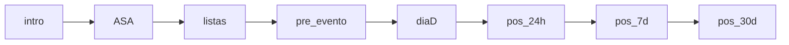

# WhatsApp AI Assistant with RAG & Admin Dashboard

## 🎯 Overview

A comprehensive WhatsApp AI Assistant built with **Interview Bot + RAG (Retrieval-Augmented Generation)** and a powerful **Admin Dashboard**. This system conducts structured interviews through WhatsApp using intelligent conversation flows enhanced by a knowledge base.

### ✨ Key Features

- **8-Stage Interview Flow**: `intro → ASA → listas → pre_evento → diaD → pos_24h → pos_7d → pos_30d`
- **RAG-Enhanced Responses**: OpenAI embeddings + vector search for contextually relevant answers
- **24h Window Management**: Session messages vs HSM templates for WhatsApp compliance
- **Comprehensive Admin Interface**: Participant management, conversation history, knowledge base, analytics
- **LGPD Compliant**: Consent tracking, data export/deletion, retention policies
- **Dark Mode Support**: Full theming with shadcn/ui components

## 🏗️ Architecture

### Tech Stack
- **Backend**: Convex (database + serverless functions)
- **Frontend**: React 19 + Vite + TypeScript + Tailwind CSS + shadcn/ui
- **AI**: OpenAI API (embeddings + generation)
- **Messaging**: Twilio WhatsApp API
- **Authentication**: Convex Auth

### Core Components

```
convex/
├── functions/
│   ├── rag.ts              # RAG pipeline (ingest, retrieve, fuse)
│   ├── interview.ts        # 8-stage interview state machine
│   ├── twilio.ts          # Enhanced WhatsApp integration
│   └── admin/             # Admin-specific functions
├── schema.ts              # Extended database schema
└── router.ts              # HTTP API endpoints

src/
├── admin/                 # Admin dashboard
│   ├── layout/           # Admin layout components
│   ├── pages/            # Admin pages (dashboard, participants, etc.)
│   └── components/       # Admin-specific components
├── types/                # TypeScript definitions
├── lib/                  # Utilities (RAG helpers, etc.)
└── components/           # Reusable UI components
```

## 🚀 Quick Start

### 1. Environment Setup

Copy the environment template:
```bash
cp .env.local.example .env.local
```

Fill in your credentials:
```env
# OpenAI
OPENAI_API_KEY=sk-...
EMBEDDINGS_MODEL=text-embedding-3-large
GENERATION_MODEL=gpt-4

# Twilio
TWILIO_ACCOUNT_SID=AC...
TWILIO_AUTH_TOKEN=...
TWILIO_WHATSAPP_NUMBER=+14155238886

# Convex (auto-provided)
CONVEX_DEPLOYMENT=your-deployment
CONVEX_URL=https://your-deployment.convex.cloud
```

### 2. Development

Start both frontend and backend:
```bash
npm run dev
```

Or start individually:
```bash
npm run dev:frontend  # React/Vite (opens browser)
npm run dev:backend   # Convex backend
```

### 3. Build & Validate

Run the comprehensive build check:
```bash
npm run lint  # TypeScript + build validation
```

Build for production:
```bash
npm run build
```

## 📊 Current Status

**✅ COMPLETED (5/12 phases - 42%)**

### Backend Core ✅
- ✅ Enhanced database schema (11 new tables)
- ✅ RAG pipeline with vector search
- ✅ 8-stage interview state machine  
- ✅ Enhanced Twilio integration
- ✅ 24h window detection & HSM support

### Admin Interface 🚧
- ✅ Basic layout and routing
- ✅ Dashboard with KPI placeholders
- ✅ Role-based navigation
- 🔄 Individual admin pages (in progress)

## 🎯 Interview Flow

The system conducts interviews through 8 carefully designed stages:



### Stage Details

1. **intro**: Consent collection & welcome
2. **ASA**: Ancestralidade, Sabedoria, Ascensão exploration
3. **listas**: Structured information gathering
4. **pre_evento**: Event preparation
5. **diaD**: Day of event experience
6. **pos_24h**: 24-hour reflection
7. **pos_7d**: One week follow-up
8. **pos_30d**: One month assessment

## 🧠 RAG System

### Document Processing
1. **Upload**: txt/md/pdf files via admin interface
2. **Chunking**: 500-800 tokens with 100-token overlap
3. **Embedding**: OpenAI text-embedding-3-large (3072 dimensions)  
4. **Storage**: Vector search in Convex database
5. **Tagging**: Automatic ASA + tema + nivel classification

### Retrieval & Response
1. **Query Embedding**: Convert user input to vector
2. **Similarity Search**: Top-k (8) most relevant chunks
3. **Context Fusion**: Combine chunks with session state
4. **Response Generation**: GPT-4 with enhanced context

## 🔐 Privacy & Security

### LGPD Compliance
- **Consent Tracking**: Explicit opt-in required
- **Data Export**: JSON export of participant data
- **Right to Deletion**: Complete data removal
- **Retention Policies**: Automatic cleanup after 180 days

### Security Features
- **State Privacy**: Interview state never exposed to users
- **Role-Based Access**: Admin functions protected by roles (owner/editor/viewer)
- **Webhook Security**: Twilio signature verification
- **Environment Variables**: All secrets externalized

## 🧪 Testing

### Manual Testing

1. **Twilio Webhook Simulation**:
```bash
curl -X POST http://localhost:3000/whatsapp/webhook \\
  -d "MessageSid=test123&From=whatsapp:+5511999999999&Body=Olá&To=whatsapp:+14155238886"
```

2. **Admin Interface**:
- Navigate to `/admin` (authentication required)
- Upload test document in Knowledge section
- Monitor participant conversations
- Test CSV import functionality

### Integration Testing
- Document ingestion → RAG retrieval verification
- Interview flow progression testing
- HSM template usage outside 24h window
- LGPD export/delete workflows

## 📈 Performance Targets

- **End-to-End**: p95 ≤ 1.5s (message → response)
- **RAG Retrieval**: p95 ≤ 800ms (query → chunks)  
- **Document Processing**: Async background jobs
- **Vector Search**: Optimized for 3072-dimension embeddings

## 🛠️ Development Notes

### Key Files Modified
- `convex/schema.ts` - Extended with interview + RAG tables
- `convex/router.ts` - Enhanced webhook processing  
- `src/main.tsx` - Router + theme provider setup
- `tailwind.config.js` - shadcn/ui compatibility

### Important Conventions
- **State Management**: Interview state stored in Convex, never sent to users
- **Error Handling**: Graceful degradation with fallback responses
- **Chunking Strategy**: Sentence-based with token estimation
- **Admin Security**: Role-based access throughout

## 🔄 Next Steps

### Phase 6: Admin Dashboard Foundation (Next)
- Enhanced KPI calculations with real data
- Real-time analytics dashboard
- User role management system  
- Performance monitoring components

### Phases 7-12: Remaining Features
- Participant & conversation management
- Knowledge system interface
- Content management by stage/cluster
- HSM template management
- CSV import functionality
- Jobs & scheduling system
- LGPD compliance tools
- Analytics & monitoring

## 📞 Support & Feedback

- **Issues**: Report at [GitHub Issues](https://github.com/anthropics/claude-code/issues)
- **Help**: Run `/help` in Claude Code CLI
- **Documentation**: [Claude Code Docs](https://docs.anthropic.com/claude-code)

---

**Generated with [Claude Code](https://claude.ai/code) 🤖**