# 🚀 Guia de Deploy e Produção

## Visão Geral

Este guia detalha como fazer o deploy do WhatsApp AI Assistant em produção, incluindo configuração de infraestrutura, variáveis de ambiente, monitoramento e manutenção.

---

## 🏗️ Arquitetura de Produção

```mermaid
graph TB
    subgraph "Frontend"
        A[Vercel/Netlify] --> B[React App]
    end
    
    subgraph "Backend"
        C[Convex Cloud] --> D[Database]
        C --> E[Functions]
        C --> F[File Storage]
    end
    
    subgraph "Integrações"
        G[Twilio WhatsApp] --> C
        H[OpenAI API] --> C
        I[GitHub OAuth] --> C
    end
    
    subgraph "Monitoramento"
        J[Convex Dashboard] --> C
        K[Logs] --> C
        L[Metrics] --> C
    end
    
    B --> C
    G --> B
```



---

## 📋 Pré-requisitos

### Contas Necessárias

1. **Convex Account**
   - Criar conta em [convex.dev](https://convex.dev)
   - Plano Pro recomendado para produção

2. **Twilio Account**
   - Conta verificada com WhatsApp Business API
   - Número WhatsApp aprovado
   - Webhook endpoints configurados

3. **OpenAI Account**
   - API key com créditos suficientes
   - Rate limits apropriados para volume esperado

4. **GitHub Account** (para OAuth)
   - OAuth App configurado
   - Client ID e Secret

5. **Vercel/Netlify** (para frontend)
   - Conta para deploy do React app

### Ferramentas de Desenvolvimento

```bash
# Instalar CLI tools
npm install -g @convex-dev/cli
npm install -g vercel  # ou netlify-cli
```

---

## 🔧 Configuração do Ambiente

### 1. Setup do Convex

```bash
# Login no Convex
npx convex login

# Criar deployment de produção
npx convex deploy --create-deployment --name whatsapp-ai-prod

# Configurar variáveis de ambiente
npx convex env set TWILIO_ACCOUNT_SID "ACxxxxxxxxxxxxxxxxxxxxxxxxxxxxxxxx"
npx convex env set TWILIO_AUTH_TOKEN "your-auth-token"
npx convex env set OPENAI_API_KEY "sk-xxxxxxxxxxxxxxxxxxxxxxxxxxxxxxxx"
npx convex env set GITHUB_CLIENT_ID "your-github-client-id"
npx convex env set GITHUB_CLIENT_SECRET "your-github-client-secret"
npx convex env set WEBHOOK_SECRET "your-webhook-secret"
```

### 2. Configuração do Twilio

#### WhatsApp Business API Setup

1. **Configurar Webhook URLs:**
   ```
   Message Webhook: https://your-deployment.convex.cloud/whatsapp/webhook
   Status Webhook: https://your-deployment.convex.cloud/whatsapp/status
   ```

2. **Configurar Sandbox (Desenvolvimento):**
   ```bash
   # Twilio Console > WhatsApp > Sandbox
   # Adicionar números de teste
   # Configurar webhook URLs
   ```

3. **Produção - WhatsApp Business API:**
   ```bash
   # Solicitar aprovação do Facebook
   # Configurar Business Manager
   # Obter número WhatsApp Business verificado
   ```

#### Validação de Webhook

```typescript
// convex/twilio.ts - Validar assinatura Twilio
import crypto from 'crypto';

export const validateTwilioSignature = (
  signature: string,
  url: string,
  body: string,
  authToken: string
): boolean => {
  const expectedSignature = crypto
    .createHmac('sha1', authToken)
    .update(url + body)
    .digest('base64');
  
  return signature === `sha1=${expectedSignature}`;
};
```

### 3. Configuração do OpenAI

```typescript
// convex/openai.ts - Configuração de produção
export const openaiConfig = {
  apiKey: process.env.OPENAI_API_KEY!,
  organization: process.env.OPENAI_ORG_ID, // Opcional
  model: "gpt-4", // ou "gpt-3.5-turbo" para economia
  maxTokens: 500,
  temperature: 0.7,
  
  // Rate limiting
  requestsPerMinute: 60,
  tokensPerMinute: 40000,
  
  // Retry configuration
  maxRetries: 3,
  retryDelay: 1000
};
```

### 4. Configuração de Autenticação

```typescript
// convex/auth.ts
import GitHub from "@auth/core/providers/github";

export default {
  providers: [
    GitHub({
      clientId: process.env.GITHUB_CLIENT_ID!,
      clientSecret: process.env.GITHUB_CLIENT_SECRET!,
    }),
  ],
  callbacks: {
    async signIn({ user, account, profile }) {
      // Validar domínio de email para admin
      const allowedDomains = ["yourcompany.com"];
      const emailDomain = user.email?.split("@")[1];
      
      return allowedDomains.includes(emailDomain || "");
    },
    
    async session({ session, token }) {
      // Adicionar role do usuário
      const dbUser = await getUserByEmail(session.user?.email);
      session.user.role = dbUser?.role || "viewer";
      return session;
    }
  }
};
```

---

## 🚀 Deploy Step-by-Step

### 1. Deploy do Backend (Convex)

```bash
# 1. Fazer build e deploy
npm run build
npx convex deploy --prod

# 2. Verificar deployment
npx convex dashboard
# Verificar se todas as functions foram deployadas
# Verificar se schema está correto
# Verificar se variáveis de ambiente estão configuradas

# 3. Executar migrations se necessário
npx convex run migrations:setupInitialData

# 4. Testar endpoints
curl https://your-deployment.convex.cloud/health
```

### 2. Deploy do Frontend

#### Opção A: Vercel

```bash
# 1. Instalar Vercel CLI
npm i -g vercel

# 2. Configurar projeto
vercel

# 3. Configurar variáveis de ambiente no Vercel
# Dashboard > Settings > Environment Variables
VITE_CONVEX_URL=https://your-deployment.convex.cloud
VITE_APP_ENV=production

# 4. Deploy
vercel --prod
```

#### Opção B: Netlify

```bash
# 1. Build local
npm run build

# 2. Deploy via CLI
netlify deploy --prod --dir=dist

# 3. Ou configurar via Git
# Conectar repositório no Netlify Dashboard
# Build command: npm run build
# Publish directory: dist
```

#### Configuração do Vite para Produção

```typescript
// vite.config.ts
import { defineConfig } from 'vite';
import react from '@vitejs/plugin-react';
import path from 'path';

export default defineConfig({
  plugins: [react()],
  resolve: {
    alias: {
      '@': path.resolve(__dirname, './src'),
    },
  },
  build: {
    outDir: 'dist',
    sourcemap: false, // Desabilitar em produção
    minify: 'terser',
    rollupOptions: {
      output: {
        manualChunks: {
          vendor: ['react', 'react-dom'],
          convex: ['convex/react'],
          ui: ['@radix-ui/react-dialog', '@radix-ui/react-dropdown-menu']
        }
      }
    }
  },
  server: {
    port: 5173,
    host: true
  }
});
```

### 3. Configuração de DNS e SSL

```bash
# Configurar domínio customizado
# Exemplo: admin.yourcompany.com

# Vercel
vercel domains add admin.yourcompany.com

# Netlify
# Dashboard > Domain settings > Add custom domain
```

---

## 🔒 Segurança em Produção

### 1. Variáveis de Ambiente Seguras

```bash
# Nunca commitar secrets
echo ".env.local" >> .gitignore
echo ".env.production" >> .gitignore

# Usar secrets management
npx convex env set --secret TWILIO_AUTH_TOKEN "your-token"
npx convex env set --secret OPENAI_API_KEY "your-key"
```

### 2. Validação de Webhooks

```typescript
// convex/security.ts
export const validateWebhookSignature = (
  signature: string,
  payload: string,
  secret: string
): boolean => {
  const expectedSignature = crypto
    .createHmac('sha256', secret)
    .update(payload)
    .digest('hex');
  
  return crypto.timingSafeEqual(
    Buffer.from(signature),
    Buffer.from(expectedSignature)
  );
};
```

### 3. Rate Limiting

```typescript
// convex/rateLimiting.ts
const rateLimits = new Map<string, { count: number; resetTime: number }>();

export const checkRateLimit = (
  identifier: string,
  limit: number,
  windowMs: number
): { allowed: boolean; remaining: number; resetTime: number } => {
  const now = Date.now();
  const key = identifier;
  
  const current = rateLimits.get(key);
  
  if (!current || now > current.resetTime) {
    const newLimit = {
      count: 1,
      resetTime: now + windowMs
    };
    rateLimits.set(key, newLimit);
    
    return {
      allowed: true,
      remaining: limit - 1,
      resetTime: newLimit.resetTime
    };
  }
  
  if (current.count >= limit) {
    return {
      allowed: false,
      remaining: 0,
      resetTime: current.resetTime
    };
  }
  
  current.count++;
  
  return {
    allowed: true,
    remaining: limit - current.count,
    resetTime: current.resetTime
  };
};
```

### 4. CORS e Headers de Segurança

```typescript
// convex/http.ts
export const corsHeaders = {
  "Access-Control-Allow-Origin": "https://yourdomain.com",
  "Access-Control-Allow-Methods": "GET, POST, PUT, DELETE, OPTIONS",
  "Access-Control-Allow-Headers": "Content-Type, Authorization",
  "X-Content-Type-Options": "nosniff",
  "X-Frame-Options": "DENY",
  "X-XSS-Protection": "1; mode=block",
  "Strict-Transport-Security": "max-age=31536000; includeSubDomains"
};
```

---

## 📊 Monitoramento e Observabilidade

### 1. Logging Estruturado

```typescript
// utils/logger.ts
export const logger = {
  info: (message: string, data?: any) => {
    console.log(JSON.stringify({
      level: 'info',
      message,
      data,
      timestamp: new Date().toISOString(),
      service: 'whatsapp-ai'
    }));
  },
  
  error: (message: string, error?: Error, data?: any) => {
    console.error(JSON.stringify({
      level: 'error',
      message,
      error: error?.message,
      stack: error?.stack,
      data,
      timestamp: new Date().toISOString(),
      service: 'whatsapp-ai'
    }));
  },
  
  warn: (message: string, data?: any) => {
    console.warn(JSON.stringify({
      level: 'warn',
      message,
      data,
      timestamp: new Date().toISOString(),
      service: 'whatsapp-ai'
    }));
  }
};
```

### 2. Health Checks

```typescript
// convex/health.ts
export const healthCheck = query({
  args: {},
  handler: async (ctx) => {
    const checks = {
      database: false,
      external_apis: {
        twilio: false,
        openai: false
      },
      timestamp: Date.now()
    };
    
    try {
      // Test database
      await ctx.db.query("participants").take(1);
      checks.database = true;
    } catch (error) {
      logger.error("Database health check failed", error);
    }
    
    // External API checks seriam feitos em actions
    
    const isHealthy = checks.database;
    
    return {
      status: isHealthy ? 'healthy' : 'unhealthy',
      checks,
      uptime: process.uptime?.() || 0
    };
  }
});
```

### 3. Métricas de Performance

```typescript
// convex/metrics.ts
export const recordMetric = mutation({
  args: {
    name: v.string(),
    value: v.number(),
    tags: v.optional(v.object({}))
  },
  handler: async (ctx, args) => {
    await ctx.db.insert("metrics", {
      name: args.name,
      value: args.value,
      tags: args.tags || {},
      timestamp: Date.now()
    });
  }
});

// Uso em functions
export const processMessage = action({
  args: { /* ... */ },
  handler: async (ctx, args) => {
    const startTime = performance.now();
    
    try {
      // Processar mensagem
      const result = await processMessageLogic(args);
      
      // Registrar métrica de sucesso
      await ctx.runMutation(internal.metrics.recordMetric, {
        name: "message_processing_duration",
        value: performance.now() - startTime,
        tags: { status: "success" }
      });
      
      return result;
    } catch (error) {
      // Registrar métrica de erro
      await ctx.runMutation(internal.metrics.recordMetric, {
        name: "message_processing_duration",
        value: performance.now() - startTime,
        tags: { status: "error", error: error.message }
      });
      
      throw error;
    }
  }
});
```

### 4. Alertas e Notificações

```typescript
// convex/alerts.ts
export const checkAlerts = internalAction({
  args: {},
  handler: async (ctx) => {
    // Verificar métricas críticas
    const errorRate = await calculateErrorRate(ctx);
    const responseTime = await calculateAverageResponseTime(ctx);
    const activeUsers = await countActiveUsers(ctx);
    
    const alerts = [];
    
    if (errorRate > 0.05) { // 5% error rate
      alerts.push({
        type: 'error_rate',
        severity: 'high',
        message: `Error rate is ${(errorRate * 100).toFixed(2)}%`,
        value: errorRate
      });
    }
    
    if (responseTime > 5000) { // 5 segundos
      alerts.push({
        type: 'response_time',
        severity: 'medium',
        message: `Average response time is ${responseTime}ms`,
        value: responseTime
      });
    }
    
    // Enviar alertas se necessário
    for (const alert of alerts) {
      await sendAlert(alert);
    }
    
    return alerts;
  }
});

// Agendar verificação de alertas
export const scheduleAlerts = internalMutation({
  args: {},
  handler: async (ctx) => {
    // Executar a cada 5 minutos
    await ctx.scheduler.runAfter(5 * 60 * 1000, internal.alerts.checkAlerts, {});
  }
});
```

---

## 🔄 CI/CD Pipeline

### GitHub Actions

```yaml
# .github/workflows/deploy.yml
name: Deploy to Production

on:
  push:
    branches: [main]
  pull_request:
    branches: [main]

jobs:
  test:
    runs-on: ubuntu-latest
    steps:
      - uses: actions/checkout@v3
      
      - name: Setup Node.js
        uses: actions/setup-node@v3
        with:
          node-version: '18'
          cache: 'npm'
      
      - name: Install dependencies
        run: npm ci
      
      - name: Run tests
        run: npm test
      
      - name: Run linting
        run: npm run lint
      
      - name: Type check
        run: npm run type-check

  deploy-backend:
    needs: test
    if: github.ref == 'refs/heads/main'
    runs-on: ubuntu-latest
    steps:
      - uses: actions/checkout@v3
      
      - name: Setup Node.js
        uses: actions/setup-node@v3
        with:
          node-version: '18'
          cache: 'npm'
      
      - name: Install dependencies
        run: npm ci
      
      - name: Deploy to Convex
        env:
          CONVEX_DEPLOY_KEY: ${{ secrets.CONVEX_DEPLOY_KEY }}
        run: |
          npx convex deploy --cmd-url-env-var-name CONVEX_URL
      
      - name: Run migrations
        env:
          CONVEX_URL: ${{ env.CONVEX_URL }}
        run: |
          npx convex run migrations:latest

  deploy-frontend:
    needs: [test, deploy-backend]
    if: github.ref == 'refs/heads/main'
    runs-on: ubuntu-latest
    steps:
      - uses: actions/checkout@v3
      
      - name: Setup Node.js
        uses: actions/setup-node@v3
        with:
          node-version: '18'
          cache: 'npm'
      
      - name: Install dependencies
        run: npm ci
      
      - name: Build
        env:
          VITE_CONVEX_URL: ${{ env.CONVEX_URL }}
        run: npm run build
      
      - name: Deploy to Vercel
        uses: amondnet/vercel-action@v20
        with:
          vercel-token: ${{ secrets.VERCEL_TOKEN }}
          vercel-org-id: ${{ secrets.VERCEL_ORG_ID }}
          vercel-project-id: ${{ secrets.VERCEL_PROJECT_ID }}
          vercel-args: '--prod'
```

### Scripts de Deploy

```bash
#!/bin/bash
# scripts/deploy.sh

set -e

echo "🚀 Starting deployment..."

# 1. Run tests
echo "🧪 Running tests..."
npm test

# 2. Build frontend
echo "🏗️ Building frontend..."
npm run build

# 3. Deploy backend
echo "📡 Deploying backend..."
npx convex deploy --prod

# 4. Run migrations
echo "🗄️ Running migrations..."
npx convex run migrations:latest

# 5. Deploy frontend
echo "🌐 Deploying frontend..."
vercel --prod

# 6. Run smoke tests
echo "🔍 Running smoke tests..."
npm run test:smoke

echo "✅ Deployment completed successfully!"
```

---

## 📈 Scaling e Performance

### 1. Database Optimization

```typescript
// Índices otimizados para queries frequentes
export default defineSchema({
  participants: defineTable({
    phoneNumber: v.string(),
    name: v.optional(v.string()),
    currentStage: v.string(),
    progress: v.number(),
    lastActivity: v.number(),
    status: v.string()
  })
  .index("by_phone", ["phoneNumber"])
  .index("by_stage", ["currentStage"])
  .index("by_activity", ["lastActivity"])
  .index("by_status_and_stage", ["status", "currentStage"]),
  
  conversations: defineTable({
    participantId: v.id("participants"),
    content: v.string(),
    direction: v.string(),
    timestamp: v.number(),
    processed: v.boolean()
  })
  .index("by_participant", ["participantId"])
  .index("by_timestamp", ["timestamp"])
  .index("by_participant_and_time", ["participantId", "timestamp"])
  .index("unprocessed", ["processed"])
});
```

### 2. Caching Strategy

```typescript
// convex/cache.ts
const cache = new Map<string, { data: any; expiry: number }>();

export const getCached = <T>(
  key: string,
  fetcher: () => Promise<T>,
  ttlMs: number = 5 * 60 * 1000 // 5 minutos
): Promise<T> => {
  const cached = cache.get(key);
  
  if (cached && Date.now() < cached.expiry) {
    return Promise.resolve(cached.data);
  }
  
  return fetcher().then(data => {
    cache.set(key, {
      data,
      expiry: Date.now() + ttlMs
    });
    return data;
  });
};

// Uso em queries
export const getPopularStages = query({
  args: {},
  handler: async (ctx) => {
    return getCached(
      'popular_stages',
      async () => {
        // Query pesada
        const stages = await ctx.db.query("participants")
          .collect()
          .then(participants => {
            // Processar dados...
            return processStageStats(participants);
          });
        return stages;
      },
      10 * 60 * 1000 // Cache por 10 minutos
    );
  }
});
```

### 3. Background Jobs

```typescript
// convex/jobs.ts
export const processBackgroundTasks = internalAction({
  args: {},
  handler: async (ctx) => {
    // Processar mensagens pendentes
    await processUnprocessedMessages(ctx);
    
    // Limpar dados antigos
    await cleanupOldData(ctx);
    
    // Gerar relatórios
    await generateDailyReports(ctx);
    
    // Agendar próxima execução
    await ctx.scheduler.runAfter(
      60 * 60 * 1000, // 1 hora
      internal.jobs.processBackgroundTasks,
      {}
    );
  }
});

const processUnprocessedMessages = async (ctx: ActionCtx) => {
  const unprocessed = await ctx.runQuery(api.conversations.getUnprocessed, {
    limit: 100
  });
  
  for (const message of unprocessed) {
    try {
      await ctx.runAction(api.ai.processMessage, {
        messageId: message._id
      });
      
      await ctx.runMutation(api.conversations.markProcessed, {
        messageId: message._id
      });
    } catch (error) {
      logger.error("Failed to process message", error, { messageId: message._id });
    }
  }
};
```

---

## 🔧 Manutenção e Backup

### 1. Backup Strategy

```typescript
// convex/backup.ts
export const createBackup = internalAction({
  args: {},
  handler: async (ctx) => {
    const timestamp = new Date().toISOString().split('T')[0];
    
    // Backup participants
    const participants = await ctx.runQuery(api.participants.exportAll, {});
    await storeBackup(`participants_${timestamp}.json`, participants);
    
    // Backup conversations
    const conversations = await ctx.runQuery(api.conversations.exportAll, {});
    await storeBackup(`conversations_${timestamp}.json`, conversations);
    
    // Backup knowledge base
    const knowledge = await ctx.runQuery(api.knowledge.exportAll, {});
    await storeBackup(`knowledge_${timestamp}.json`, knowledge);
    
    logger.info("Backup completed", { timestamp });
  }
});

// Agendar backup diário
export const scheduleBackup = internalMutation({
  args: {},
  handler: async (ctx) => {
    // Todo dia às 2:00 AM
    const tomorrow = new Date();
    tomorrow.setDate(tomorrow.getDate() + 1);
    tomorrow.setHours(2, 0, 0, 0);
    
    const msUntilBackup = tomorrow.getTime() - Date.now();
    
    await ctx.scheduler.runAfter(msUntilBackup, internal.backup.createBackup, {});
  }
});
```

### 2. Data Cleanup

```typescript
// convex/cleanup.ts
export const cleanupOldData = internalMutation({
  args: {},
  handler: async (ctx) => {
    const thirtyDaysAgo = Date.now() - (30 * 24 * 60 * 60 * 1000);
    
    // Limpar logs antigos
    const oldLogs = await ctx.db
      .query("logs")
      .filter((q) => q.lt(q.field("timestamp"), thirtyDaysAgo))
      .collect();
    
    for (const log of oldLogs) {
      await ctx.db.delete(log._id);
    }
    
    // Limpar métricas antigas
    const oldMetrics = await ctx.db
      .query("metrics")
      .filter((q) => q.lt(q.field("timestamp"), thirtyDaysAgo))
      .collect();
    
    for (const metric of oldMetrics) {
      await ctx.db.delete(metric._id);
    }
    
    logger.info("Cleanup completed", {
      logsDeleted: oldLogs.length,
      metricsDeleted: oldMetrics.length
    });
  }
});
```

---

## 🚨 Troubleshooting de Produção

### 1. Problemas Comuns

#### High Error Rate
```bash
# Verificar logs
npx convex logs --tail --filter error

# Verificar métricas
npx convex dashboard
# Ir para Metrics > Error Rate

# Verificar external APIs
curl -I https://api.openai.com/v1/models
curl -I https://api.twilio.com/2010-04-01/Accounts.json
```

#### Slow Response Times
```bash
# Verificar performance de queries
npx convex logs --tail --filter "slow query"

# Verificar índices
# Dashboard > Database > Indexes
# Procurar por queries sem índices
```

#### Memory Issues
```bash
# Verificar usage no dashboard
# Dashboard > Usage > Memory

# Verificar memory leaks
npx convex logs --tail --filter "memory"
```

### 2. Rollback Strategy

```bash
#!/bin/bash
# scripts/rollback.sh

PREVIOUS_DEPLOYMENT=$1

if [ -z "$PREVIOUS_DEPLOYMENT" ]; then
  echo "Usage: ./rollback.sh <deployment-id>"
  exit 1
fi

echo "🔄 Rolling back to deployment: $PREVIOUS_DEPLOYMENT"

# Rollback backend
npx convex rollback $PREVIOUS_DEPLOYMENT

# Rollback frontend
vercel rollback $PREVIOUS_DEPLOYMENT

echo "✅ Rollback completed"
```

---

## 📋 Checklist de Deploy

### Pré-Deploy
- [ ] Todos os testes passando
- [ ] Code review aprovado
- [ ] Variáveis de ambiente configuradas
- [ ] Backup realizado
- [ ] Documentação atualizada

### Deploy
- [ ] Backend deployado com sucesso
- [ ] Migrations executadas
- [ ] Frontend deployado
- [ ] Health checks passando
- [ ] Smoke tests executados

### Pós-Deploy
- [ ] Monitoramento ativo
- [ ] Logs sendo coletados
- [ ] Métricas normais
- [ ] Alertas configurados
- [ ] Equipe notificada

---

**🎯 Próximos Passos:**
1. Configurar monitoramento avançado
2. Implementar A/B testing
3. Otimizar performance
4. Configurar disaster recovery
5. Documentar runbooks operacionais