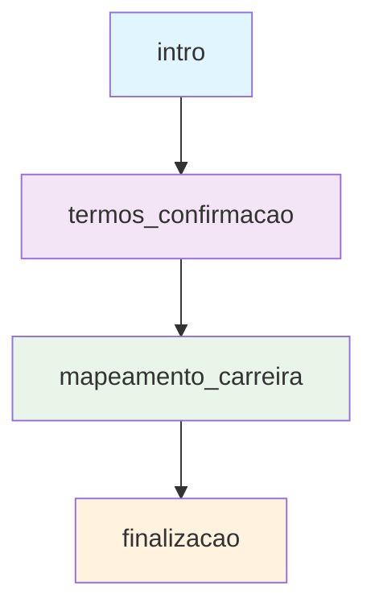

# 🎭 Fluxo de Entrevista - 4 Etapas

## Visão Geral

O sistema implementa um fluxo de entrevista estruturado em 4 etapas, guiando o usuário através de uma jornada de desenvolvimento profissional focada em **Mapeamento de Carreira**.

**Duração Estimada**: 30-45 minutos por usuário
**Progressão**: Linear com possibilidade de revisitar etapas anteriores

---

## 🗺️ Mapa das Etapas



---

## 📋 Detalhamento das Etapas

### 1️⃣ Etapa: `intro`
**Objetivo**: Estabelecer consentimento e apresentar a jornada

#### Fluxo da Conversa
```typescript
interface IntroStage {
  purpose: "Coleta de consentimento LGPD e apresentação",
  duration: "3-5 minutos",
  keyActions: [
    "Apresentação do bot e propósito",
    "Solicitação de consentimento para coleta de dados",
    "Explicação da jornada de carreira",
    "Confirmação de participação voluntária"
  ]
}
```

#### Exemplo de Interação
```
🤖 Bot: "Olá! Sou seu guia nesta jornada de desenvolvimento profissional. Para começarmos, preciso do seu consentimento para coletar e processar seus dados durante nossa conversa. Você concorda?"

👤 Usuário: "Sim, concordo"

🤖 Bot: "Perfeito! Vamos explorar juntos seu mapeamento de carreira. Esta é uma experiência transformadora que pode durar entre 30-45 minutos. Está pronto para começar?"
```

#### Critérios de Progressão
- ✅ Consentimento explícito coletado
- ✅ Usuário confirma disponibilidade
- ✅ Expectativas alinhadas

#### Dados Coletados
```typescript
interface IntroData {
  consentGiven: boolean,
  consentTimestamp: Date,
  userReadiness: boolean,
  initialMotivation?: string
}
```

---

### 2️⃣ Etapa: `termos_confirmacao`
**Objetivo**: Confirmar termos de uso e privacidade

#### Fluxo da Conversa
```typescript
interface TermosStage {
  purpose: "Confirmação de termos de uso e privacidade",
  duration: "2-3 minutos",
  keyActions: [
    "Apresentar termos de uso",
    "Explicar política de privacidade",
    "Confirmar aceite dos termos",
    "Validar entendimento sobre uso dos dados"
  ]
}
```

---

### 3️⃣ Etapa: `mapeamento_carreira`
**Objetivo**: Explorar trajetória profissional e objetivos de carreira

#### Fluxo da Conversa
```typescript
interface MapeamentoCarreiraStage {
  purpose: "Mapear trajetória profissional, competências e objetivos",
  duration: "20-30 minutos",
  keyActions: [
    "Identificar momento atual da carreira",
    "Explorar expectativas do Future in Black",
    "Descobrir valor desejado e objetivos",
    "Reconhecer competências e diferenciais únicos"
  ]
}
```

#### Áreas de Exploração
```typescript
interface CarreiraAreas {
  momentoCarreira: {
    prompt: "Onde você sente que está agora na sua jornada profissional?",
    followUp: [
      "O que te trouxe até aqui?",
      "Quais foram os marcos mais importantes?",
      "Como você avalia seu crescimento atual?"
    ]
  },
  expectativasFutureInBlack: {
    prompt: "O que você espera que esse evento possa te provocar ou desbloquear?",
    followUp: [
      "Que tipo de inspiração você busca?",
      "Quais conexões seriam valiosas?",
      "Que insights poderiam transformar sua carreira?"
    ]
  },
  valorDesejado: {
    prompt: "Se você pudesse sair desse encontro com apenas uma coisa valiosa, o que seria?",
    followUp: [
      "Como isso impactaria sua trajetória?",
      "Que mudanças concretas isso geraria?",
      "Como você aplicaria isso no seu dia a dia?"
    ]
  }
}
```

---

### 4️⃣ Etapa: `finalizacao`
**Objetivo**: Consolidar insights e definir próximos passos
#### Fluxo da Conversa
```typescript
interface FinalizacaoStage {
  purpose: "Consolidar insights e definir próximos passos",
  duration: "5-10 minutos",
  keyActions: [
    "Resumir principais insights da jornada",
    "Identificar ações concretas pós-evento",
    "Definir metas de networking",
    "Estabelecer plano de acompanhamento"
  ]
}
```

#### Áreas de Consolidação
```typescript
interface FinalizacaoAreas {
  insightsChave: {
    prompt: "Qual foi o principal insight sobre sua carreira durante nossa conversa?",
    followUp: [
      "Como isso muda sua perspectiva?",
      "Que ações concretas isso sugere?",
      "Como você vai aplicar isso no Future in Black?"
    ]
  },
  proximosPassos: {
    prompt: "Quais são seus próximos passos após o evento?",
    followUp: [
      "Que conexões você quer fazer?",
      "Que oportunidades você vai buscar?",
      "Como você vai manter o momentum?"
    ]
  },
  compromissos: {
    prompt: "Que compromisso você faz consigo mesmo para os próximos 30 dias?",
    followUp: [
      "Como você vai medir o progresso?",
      "Que suporte você precisa?",
      "Quando você vai revisar seus objetivos?"
    ]
  }
}
```

#### Dados Coletados
```typescript
interface FinalizacaoData {
  insightsPrincipais: string[],
  acoesPlanejadas: string[],
  metasNetworking: string[],
  compromissos30Dias: string[],
  suporteNecessario: string[],
  proximaRevisao: Date
}
```

---

## 🔄 Transições Entre Etapas

### Critérios de Progressão
Cada etapa possui critérios específicos que devem ser atendidos antes da transição:

#### `intro` → `termos_confirmacao`
- ✅ Consentimento LGPD coletado
- ✅ Usuário demonstra compreensão do processo
- ✅ Disponibilidade confirmada

#### `termos_confirmacao` → `mapeamento_carreira`
- ✅ Termos de uso aceitos
- ✅ Política de privacidade compreendida
- ✅ Confirmação de participação voluntária

#### `mapeamento_carreira` → `finalizacao`
- ✅ Momento de carreira mapeado
- ✅ Expectativas do evento clarificadas
- ✅ Valor desejado identificado
- ✅ Competências e diferenciais reconhecidos

### Mecanismo de Validação
```typescript
interface StageValidation {
  validateTransition(
    currentStage: InterviewStage,
    nextStage: InterviewStage,
    userData: UserData
  ): {
    canProgress: boolean,
    missingCriteria: string[],
    recommendations: string[]
  }
}
```

---

## 📊 Análise e Processamento

### Coleta de Dados
Durante cada etapa, o sistema coleta dados estruturados que alimentam:

#### 1. **Perfil de Carreira**
```typescript
interface CareerProfile {
  momentoAtual: string,
  expectativasEvento: string[],
  valorDesejado: string,
  competenciasChave: string[],
  objetivosCarreira: string[],
  redesNetworking: string[]
}
```

#### 2. **Insights Personalizados**
- Análise de padrões nas respostas
- Identificação de temas recorrentes
- Sugestões de conexões relevantes
- Recomendações de conteúdo do evento

#### 3. **Métricas de Engajamento**
```typescript
interface EngagementMetrics {
  tempoTotalSessao: number,
  profundidadeRespostas: 'superficial' | 'moderada' | 'profunda',
  temasPrincipais: string[],
  nivelReflexao: number,
  pontuacaoCompletude: number
}
```

---

## 🎯 Personalização e Recomendações

### Sistema de Recomendações
Com base nos dados coletados, o sistema gera:

#### **Conteúdo Personalizado**
- Sessões do evento mais relevantes
- Palestrantes alinhados com interesses
- Workshops recomendados
- Materiais de leitura sugeridos

#### **Networking Direcionado**
- Perfis de participantes similares
- Conexões estratégicas sugeridas
- Grupos de interesse comum
- Mentores potenciais

#### **Plano de Ação Pós-Evento**
- Próximos passos específicos
- Recursos para desenvolvimento
- Cronograma de acompanhamento
- Métricas de progresso

---

## 🔧 Implementação Técnica

### Estados da Entrevista
```typescript
type InterviewStage = 
  | 'intro'
  | 'termos_confirmacao' 
  | 'mapeamento_carreira'
  | 'finalizacao'
  | 'completed';

interface InterviewState {
  currentStage: InterviewStage,
  completedStages: InterviewStage[],
  userData: Record<string, any>,
  startTime: Date,
  lastActivity: Date,
  progressPercentage: number
}
```

### Validação de Progressão
```typescript
interface StageValidator {
  canProgress(stage: InterviewStage, data: any): boolean;
  getRequiredFields(stage: InterviewStage): string[];
  validateData(stage: InterviewStage, data: any): ValidationResult;
}
```

### Persistência de Dados
- Dados salvos automaticamente a cada resposta
- Backup em tempo real no Convex
- Recuperação de sessão em caso de desconexão
- Histórico completo para análise posterior

---

## 📈 Métricas e Analytics

### KPIs Principais
- **Taxa de Conclusão**: % de usuários que completam todas as etapas
- **Tempo Médio por Etapa**: Duração típica de cada fase
- **Profundidade de Engajamento**: Qualidade das respostas
- **Pontos de Abandono**: Onde usuários mais desistem

### Relatórios Gerados
- Dashboard de progresso individual
- Análise de padrões de carreira
- Recomendações personalizadas
- Insights para melhoria do evento
    "Estabelecer possibilidade de follow-up"
  ]
}
```

#### Elementos de Fechamento
```typescript
interface CompletedElements {
  celebracao: {
    message: "Parabéns por completar esta jornada de autoconhecimento!",
    recognition: "Reconhecimento do esforço e abertura do usuário"
  },
  resumoJornada: {
    insights: "Principais descobertas da conversa",
    crescimento: "Áreas de crescimento identificadas",
    forças: "Pontos fortes reconhecidos"
  },
  recursosContinu: {
    materiais: "Links para recursos adicionais",
    exercicios: "Práticas para manter o crescimento",
    comunidade: "Conexão com outros participantes"
  },
  followUp: {
    agendamento: "Possibilidade de nova conversa",
    contato: "Como manter contato",
    feedback: "Solicitação de feedback sobre a experiência"
  }
}
```

#### Dados Finais
```typescript
interface CompletedData {
  dataFinalizacao: Date,
  duracaoTotal: number, // minutos
  satisfacaoUsuario: number, // 1-10
  feedbackExperiencia: string,
  interesseFollowUp: boolean,
  resumoGerado: {
    insights: string[],
    compromissos: string[],
    proximosPassos: string[]
  }
}
```

---

## 🔄 Gestão de Estado

### Estado da Entrevista
```typescript
interface InterviewState {
  currentStage: StageType,
  stageProgress: {
    [stage: string]: {
      startTime: Date,
      endTime?: Date,
      progress: number, // 0-100
      keyData: any,
      completed: boolean
    }
  },
  overallProgress: number, // 0-100
  totalMessages: number,
  estimatedTimeRemaining: number, // minutos
  lastActivity: Date
}
```

### Transições de Etapa
```typescript
interface StageTransition {
  from: StageType,
  to: StageType,
  trigger: 'completion' | 'user_request' | 'timeout' | 'admin_override',
  timestamp: Date,
  completionCriteria: {
    dataCollected: boolean,
    userEngagement: boolean,
    timeSpent: boolean,
    qualityThreshold: boolean
  }
}
```

---

## 📊 Analytics e Métricas

### Métricas por Etapa
```typescript
interface StageAnalytics {
  averageDuration: number, // minutos
  completionRate: number, // %
  dropoffRate: number, // %
  userSatisfaction: number, // 1-10
  commonStickingPoints: string[],
  mostEffectivePrompts: string[],
  dataQualityScore: number // 1-10
}
```

### Funil de Conversão
```typescript
interface ConversionFunnel {
  intro: { started: number, completed: number },
  ASA: { started: number, completed: number },
  sabedoria: { started: number, completed: number },
  ancestralidade: { started: number, completed: number },
  ascensao: { started: number, completed: number },
  integracao: { started: number, completed: number },
  compromisso: { started: number, completed: number },
  completed: { started: number, completed: number }
}
```

---

## 🎯 Otimização do Fluxo

### Personalização por Usuário
```typescript
interface UserPersonalization {
  communicationStyle: 'formal' | 'casual' | 'empathetic',
  pacePreference: 'slow' | 'medium' | 'fast',
  depthPreference: 'surface' | 'moderate' | 'deep',
  topicSensitivity: string[], // tópicos sensíveis
  preferredPillar: 'ancestralidade' | 'sabedoria' | 'ascensao'
}
```

### Adaptação Dinâmica
```typescript
interface DynamicAdaptation {
  responseLength: 'short' | 'medium' | 'long',
  questionComplexity: 'simple' | 'moderate' | 'complex',
  emotionalSupport: 'minimal' | 'moderate' | 'high',
  challengeLevel: 'gentle' | 'moderate' | 'intense'
}
```

---

## 🚨 Situações Especiais

### Usuário Resistente
```typescript
interface ResistanceHandling {
  signs: [
    "Respostas muito curtas",
    "Mudança de assunto frequente",
    "Expressão de desconforto",
    "Questionamento do processo"
  ],
  strategies: [
    "Validar sentimentos",
    "Explicar benefícios",
    "Oferecer pausa",
    "Adaptar abordagem"
  ]
}
```

### Usuário Muito Emotivo
```typescript
interface EmotionalSupport {
  triggers: [
    "Menção de trauma",
    "Expressão de tristeza intensa",
    "Revelação de conflitos familiares",
    "Ansiedade sobre o futuro"
  ],
  responses: [
    "Validação empática",
    "Pausa para processamento",
    "Redirecionamento gentil",
    "Oferta de recursos de apoio"
  ]
}
```

### Timeout de Etapa
```typescript
interface TimeoutHandling {
  maxDurationPerStage: 20, // minutos
  warningAt: 15, // minutos
  actions: [
    "Aviso gentil sobre tempo",
    "Resumo do progresso",
    "Opção de continuar ou pausar",
    "Salvamento automático do estado"
  ]
}
```

---

## 🔧 Configuração Técnica

### Prompts por Etapa
```typescript
interface StagePrompts {
  [stage: string]: {
    systemPrompt: string,
    openingPrompt: string,
    followUpPrompts: string[],
    transitionPrompt: string,
    completionCriteria: string[]
  }
}
```

### Validação de Dados
```typescript
interface DataValidation {
  [stage: string]: {
    requiredFields: string[],
    optionalFields: string[],
    validationRules: {
      [field: string]: (value: any) => boolean
    },
    qualityThresholds: {
      minWordCount: number,
      maxWordCount: number,
      sentimentRange: [number, number]
    }
  }
}
```

---

**💡 Dica**: O fluxo é projetado para ser flexível - usuários podem revisitar etapas anteriores se necessário, e o sistema se adapta ao ritmo e estilo de cada pessoa!