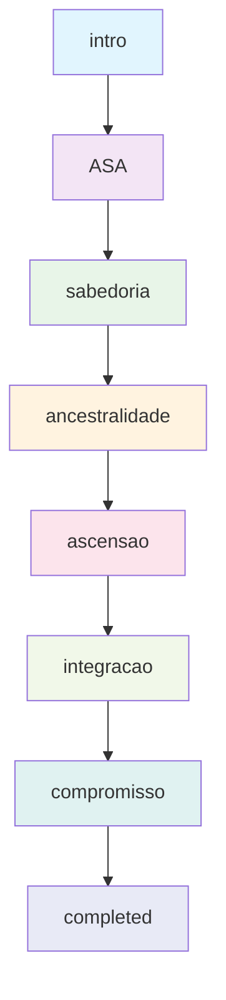

# 🎭 Fluxo de Entrevista - 8 Etapas

## Visão Geral

O sistema implementa um fluxo de entrevista estruturado em 8 etapas, guiando o usuário através de uma jornada de autoconhecimento focada em **Ancestralidade**, **Sabedoria** e **Ascensão** (ASA).

**Duração Estimada**: 45-90 minutos por usuário
**Progressão**: Linear com possibilidade de revisitar etapas anteriores

---

## 🗺️ Mapa das Etapas



---

## 📋 Detalhamento das Etapas

### 1️⃣ Etapa: `intro`
**Objetivo**: Estabelecer consentimento e apresentar a jornada

#### Fluxo da Conversa
```typescript
interface IntroStage {
  purpose: "Coleta de consentimento LGPD e apresentação",
  duration: "3-5 minutos",
  keyActions: [
    "Apresentação do bot e propósito",
    "Solicitação de consentimento para coleta de dados",
    "Explicação da jornada ASA",
    "Confirmação de participação voluntária"
  ]
}
```

#### Exemplo de Interação
```
🤖 Bot: "Olá! Sou seu guia nesta jornada de autoconhecimento. Para começarmos, preciso do seu consentimento para coletar e processar seus dados durante nossa conversa. Você concorda?"

👤 Usuário: "Sim, concordo"

🤖 Bot: "Perfeito! Vamos explorar juntos sua jornada de Ancestralidade, Sabedoria e Ascensão. Esta é uma experiência transformadora que pode durar entre 45-90 minutos. Está pronto para começar?"
```

#### Critérios de Progressão
- ✅ Consentimento explícito coletado
- ✅ Usuário confirma disponibilidade
- ✅ Expectativas alinhadas

#### Dados Coletados
```typescript
interface IntroData {
  consentGiven: boolean,
  consentTimestamp: Date,
  userReadiness: boolean,
  initialMotivation?: string
}
```

---

### 2️⃣ Etapa: `ASA`
**Objetivo**: Introduzir os três pilares da jornada

#### Fluxo da Conversa
```typescript
interface ASAStage {
  purpose: "Apresentar Ancestralidade, Sabedoria e Ascensão",
  duration: "5-8 minutos",
  keyActions: [
    "Explicar o conceito de Ancestralidade",
    "Definir Sabedoria no contexto pessoal",
    "Apresentar Ascensão como crescimento",
    "Identificar qual pilar ressoa mais"
  ]
}
```

#### Conceitos Explorados
```typescript
interface ASAConcepts {
  ancestralidade: {
    definition: "Conexão com suas raízes, família e tradições",
    questions: [
      "Que histórias familiares te marcaram?",
      "Quais tradições você valoriza?",
      "Como seu passado influencia quem você é hoje?"
    ]
  },
  sabedoria: {
    definition: "Conhecimento aplicado com discernimento",
    questions: [
      "Que lições importantes você aprendeu?",
      "Como você toma decisões difíceis?",
      "Qual conhecimento você gostaria de compartilhar?"
    ]
  },
  ascensao: {
    definition: "Crescimento pessoal e evolução contínua",
    questions: [
      "Onde você se vê daqui a 5 anos?",
      "Que aspectos de si mesmo quer desenvolver?",
      "Como você define sucesso pessoal?"
    ]
  }
}
```

#### Critérios de Progressão
- ✅ Usuário demonstra compreensão dos três pilares
- ✅ Identifica qual pilar mais ressoa
- ✅ Expressa interesse em explorar mais profundamente

---

### 3️⃣ Etapa: `sabedoria`
**Objetivo**: Explorar conhecimentos e aprendizados pessoais

#### Fluxo da Conversa
```typescript
interface SabedoriaStage {
  purpose: "Mapear conhecimentos, experiências e insights pessoais",
  duration: "10-15 minutos",
  keyActions: [
    "Identificar experiências formativas",
    "Explorar lições aprendidas",
    "Descobrir padrões de tomada de decisão",
    "Reconhecer sabedoria única do usuário"
  ]
}
```

#### Áreas de Exploração
```typescript
interface SabedoriaAreas {
  experienciasFormativas: {
    prompt: "Conte-me sobre uma experiência que mudou sua perspectiva de vida",
    followUp: [
      "O que exatamente mudou em você?",
      "Como isso influencia suas decisões hoje?",
      "Que conselho você daria para alguém passando por algo similar?"
    ]
  },
  tomadaDecisao: {
    prompt: "Como você costuma tomar decisões importantes?",
    followUp: [
      "Você confia mais na razão ou na intuição?",
      "Que fatores são mais importantes para você?",
      "Já tomou alguma decisão que parecia errada mas se mostrou certa?"
    ]
  },
  conhecimentoUnico: {
    prompt: "Que conhecimento ou habilidade você tem que poucos possuem?",
    followUp: [
      "Como você desenvolveu isso?",
      "De que forma isso te diferencia?",
      "Como você usa isso para ajudar outros?"
    ]
  }
}
```

#### Dados Coletados
```typescript
interface SabedoriaData {
  experienciasChave: string[],
  licoesAprendidas: string[],
  estiloDecisao: 'intuitivo' | 'racional' | 'misto',
  conhecimentosUnicos: string[],
  valoresCore: string[],
  mentores: string[]
}
```

---

### 4️⃣ Etapa: `ancestralidade`
**Objetivo**: Conectar com raízes, família e tradições

#### Fluxo da Conversa
```typescript
interface AncestralIdadeStage {
  purpose: "Explorar conexões familiares, culturais e históricas",
  duration: "10-15 minutos",
  keyActions: [
    "Mapear influências familiares",
    "Identificar tradições importantes",
    "Explorar herança cultural",
    "Reconhecer padrões geracionais"
  ]
}
```

#### Áreas de Exploração
```typescript
interface AncestralIdadeAreas {
  influenciasFamiliares: {
    prompt: "Que pessoa da sua família mais te influenciou e por quê?",
    followUp: [
      "Que características dessa pessoa você vê em si?",
      "Que lições ela te ensinou?",
      "Como você honra essa influência hoje?"
    ]
  },
  tradicoesCulturais: {
    prompt: "Que tradições familiares ou culturais são importantes para você?",
    followUp: [
      "Como essas tradições moldam sua identidade?",
      "Quais você pretende passar adiante?",
      "Alguma tradição você escolheu não seguir? Por quê?"
    ]
  },
  historiasOrigens: {
    prompt: "Que história sobre suas origens mais te marca?",
    followUp: [
      "Como essa história te conecta com seu passado?",
      "Que valores ela representa?",
      "Como ela influencia suas escolhas atuais?"
    ]
  }
}
```

#### Dados Coletados
```typescript
interface AncestralIdadeData {
  influenciasPrincipais: {
    pessoa: string,
    relacao: string,
    influencia: string
  }[],
  tradicoesValoradas: string[],
  herancaCultural: string[],
  historiasOrigens: string[],
  padroesGeracionais: string[]
}
```

---

### 5️⃣ Etapa: `ascensao`
**Objetivo**: Explorar crescimento pessoal e aspirações futuras

#### Fluxo da Conversa
```typescript
interface AscensaoStage {
  purpose: "Mapear objetivos, sonhos e potencial de crescimento",
  duration: "10-15 minutos",
  keyActions: [
    "Identificar aspirações pessoais",
    "Explorar definição pessoal de sucesso",
    "Mapear áreas de crescimento desejado",
    "Visualizar futuro ideal"
  ]
}
```

#### Áreas de Exploração
```typescript
interface AscensaoAreas {
  visaoFuturo: {
    prompt: "Como você se vê daqui a 5 anos?",
    followUp: [
      "O que precisa acontecer para chegar lá?",
      "Que obstáculos você antecipa?",
      "Como você vai saber que chegou onde queria?"
    ]
  },
  definicaoSucesso: {
    prompt: "Como você define sucesso na sua vida?",
    followUp: [
      "Isso mudou ao longo do tempo?",
      "Que papel os outros têm no seu sucesso?",
      "Sucesso para você é mais interno ou externo?"
    ]
  },
  crescimentoPessoal: {
    prompt: "Que aspecto de si mesmo você mais quer desenvolver?",
    followUp: [
      "Por que essa área é importante para você?",
      "Que passos já está tomando nessa direção?",
      "Como vai medir seu progresso?"
    ]
  }
}
```

#### Dados Coletados
```typescript
interface AscensaoData {
  visaoFuturo: string,
  definicaoSucesso: string,
  areasDesenvolvimento: string[],
  objetivosPrincipais: string[],
  motivacoesProfundas: string[],
  medidasProgresso: string[]
}
```

---

### 6️⃣ Etapa: `integracao`
**Objetivo**: Conectar os três pilares em uma visão coesa

#### Fluxo da Conversa
```typescript
interface IntegracaoStage {
  purpose: "Sintetizar insights dos três pilares em uma narrativa coesa",
  duration: "8-12 minutos",
  keyActions: [
    "Identificar conexões entre os pilares",
    "Sintetizar insights principais",
    "Criar narrativa pessoal integrada",
    "Reconhecer padrões e temas recorrentes"
  ]
}
```

#### Processo de Integração
```typescript
interface IntegracaoProcess {
  sintese: {
    prompt: "Olhando para tudo que conversamos, que padrões você vê?",
    analysis: [
      "Como sua ancestralidade influencia sua sabedoria?",
      "De que forma sua sabedoria guia sua ascensão?",
      "Como sua visão de futuro honra suas raízes?"
    ]
  },
  narrativaPessoal: {
    prompt: "Se você fosse contar sua história em poucas palavras, como seria?",
    elements: [
      "Tema central da sua jornada",
      "Valores que te guiam",
      "Missão ou propósito pessoal"
    ]
  },
  reconhecimentoPadrao: {
    prompt: "Que tema ou valor aparece em todas as áreas da sua vida?",
    insights: [
      "Forças recorrentes",
      "Desafios consistentes",
      "Oportunidades de crescimento"
    ]
  }
}
```

#### Dados Coletados
```typescript
interface IntegracaoData {
  padroesPrincipais: string[],
  narrativaPessoal: string,
  temasCentrales: string[],
  conexoesPilares: {
    ancestralidadeSabedoria: string,
    sabedoriaAscensao: string,
    ascensaoAncestralidade: string
  },
  insightsPrincipais: string[]
}
```

---

### 7️⃣ Etapa: `compromisso`
**Objetivo**: Estabelecer compromissos concretos para o futuro

#### Fluxo da Conversa
```typescript
interface CompromissoStage {
  purpose: "Transformar insights em ações concretas e compromissos",
  duration: "8-12 minutos",
  keyActions: [
    "Definir ações específicas",
    "Estabelecer prazos realistas",
    "Identificar recursos necessários",
    "Criar sistema de acompanhamento"
  ]
}
```

#### Estrutura de Compromissos
```typescript
interface CompromissoStructure {
  acoesCurto: {
    prazo: "30 dias",
    prompt: "O que você vai fazer nos próximos 30 dias baseado em nossa conversa?",
    criteria: [
      "Específico e mensurável",
      "Conectado aos insights da entrevista",
      "Realista e alcançável"
    ]
  },
  acoesMedio: {
    prazo: "6 meses",
    prompt: "Que mudança maior você quer ver em 6 meses?",
    criteria: [
      "Alinhado com visão de futuro",
      "Baseado nos pilares ASA",
      "Desafiador mas possível"
    ]
  },
  sistemaSuporte: {
    prompt: "Que apoio você precisa para cumprir esses compromissos?",
    elements: [
      "Pessoas que podem ajudar",
      "Recursos necessários",
      "Obstáculos a superar"
    ]
  }
}
```

#### Dados Coletados
```typescript
interface CompromissoData {
  acoesCurtoPrazo: {
    acao: string,
    prazo: Date,
    medida: string
  }[],
  acoesMedioPrazo: {
    objetivo: string,
    prazo: Date,
    marcos: string[]
  }[],
  sistemaSuporte: {
    pessoas: string[],
    recursos: string[],
    obstaculos: string[]
  },
  compromissoPublico?: string
}
```

---

### 8️⃣ Etapa: `completed`
**Objetivo**: Finalizar a jornada e fornecer recursos para continuidade

#### Fluxo da Conversa
```typescript
interface CompletedStage {
  purpose: "Celebrar a jornada e fornecer recursos para continuidade",
  duration: "5-8 minutos",
  keyActions: [
    "Celebrar a conclusão da jornada",
    "Resumir principais insights",
    "Fornecer recursos para continuidade",
    "Estabelecer possibilidade de follow-up"
  ]
}
```

#### Elementos de Fechamento
```typescript
interface CompletedElements {
  celebracao: {
    message: "Parabéns por completar esta jornada de autoconhecimento!",
    recognition: "Reconhecimento do esforço e abertura do usuário"
  },
  resumoJornada: {
    insights: "Principais descobertas da conversa",
    crescimento: "Áreas de crescimento identificadas",
    forças: "Pontos fortes reconhecidos"
  },
  recursosContinu: {
    materiais: "Links para recursos adicionais",
    exercicios: "Práticas para manter o crescimento",
    comunidade: "Conexão com outros participantes"
  },
  followUp: {
    agendamento: "Possibilidade de nova conversa",
    contato: "Como manter contato",
    feedback: "Solicitação de feedback sobre a experiência"
  }
}
```

#### Dados Finais
```typescript
interface CompletedData {
  dataFinalizacao: Date,
  duracaoTotal: number, // minutos
  satisfacaoUsuario: number, // 1-10
  feedbackExperiencia: string,
  interesseFollowUp: boolean,
  resumoGerado: {
    insights: string[],
    compromissos: string[],
    proximosPassos: string[]
  }
}
```

---

## 🔄 Gestão de Estado

### Estado da Entrevista
```typescript
interface InterviewState {
  currentStage: StageType,
  stageProgress: {
    [stage: string]: {
      startTime: Date,
      endTime?: Date,
      progress: number, // 0-100
      keyData: any,
      completed: boolean
    }
  },
  overallProgress: number, // 0-100
  totalMessages: number,
  estimatedTimeRemaining: number, // minutos
  lastActivity: Date
}
```

### Transições de Etapa
```typescript
interface StageTransition {
  from: StageType,
  to: StageType,
  trigger: 'completion' | 'user_request' | 'timeout' | 'admin_override',
  timestamp: Date,
  completionCriteria: {
    dataCollected: boolean,
    userEngagement: boolean,
    timeSpent: boolean,
    qualityThreshold: boolean
  }
}
```

---

## 📊 Analytics e Métricas

### Métricas por Etapa
```typescript
interface StageAnalytics {
  averageDuration: number, // minutos
  completionRate: number, // %
  dropoffRate: number, // %
  userSatisfaction: number, // 1-10
  commonStickingPoints: string[],
  mostEffectivePrompts: string[],
  dataQualityScore: number // 1-10
}
```

### Funil de Conversão
```typescript
interface ConversionFunnel {
  intro: { started: number, completed: number },
  ASA: { started: number, completed: number },
  sabedoria: { started: number, completed: number },
  ancestralidade: { started: number, completed: number },
  ascensao: { started: number, completed: number },
  integracao: { started: number, completed: number },
  compromisso: { started: number, completed: number },
  completed: { started: number, completed: number }
}
```

---

## 🎯 Otimização do Fluxo

### Personalização por Usuário
```typescript
interface UserPersonalization {
  communicationStyle: 'formal' | 'casual' | 'empathetic',
  pacePreference: 'slow' | 'medium' | 'fast',
  depthPreference: 'surface' | 'moderate' | 'deep',
  topicSensitivity: string[], // tópicos sensíveis
  preferredPillar: 'ancestralidade' | 'sabedoria' | 'ascensao'
}
```

### Adaptação Dinâmica
```typescript
interface DynamicAdaptation {
  responseLength: 'short' | 'medium' | 'long',
  questionComplexity: 'simple' | 'moderate' | 'complex',
  emotionalSupport: 'minimal' | 'moderate' | 'high',
  challengeLevel: 'gentle' | 'moderate' | 'intense'
}
```

---

## 🚨 Situações Especiais

### Usuário Resistente
```typescript
interface ResistanceHandling {
  signs: [
    "Respostas muito curtas",
    "Mudança de assunto frequente",
    "Expressão de desconforto",
    "Questionamento do processo"
  ],
  strategies: [
    "Validar sentimentos",
    "Explicar benefícios",
    "Oferecer pausa",
    "Adaptar abordagem"
  ]
}
```

### Usuário Muito Emotivo
```typescript
interface EmotionalSupport {
  triggers: [
    "Menção de trauma",
    "Expressão de tristeza intensa",
    "Revelação de conflitos familiares",
    "Ansiedade sobre o futuro"
  ],
  responses: [
    "Validação empática",
    "Pausa para processamento",
    "Redirecionamento gentil",
    "Oferta de recursos de apoio"
  ]
}
```

### Timeout de Etapa
```typescript
interface TimeoutHandling {
  maxDurationPerStage: 20, // minutos
  warningAt: 15, // minutos
  actions: [
    "Aviso gentil sobre tempo",
    "Resumo do progresso",
    "Opção de continuar ou pausar",
    "Salvamento automático do estado"
  ]
}
```

---

## 🔧 Configuração Técnica

### Prompts por Etapa
```typescript
interface StagePrompts {
  [stage: string]: {
    systemPrompt: string,
    openingPrompt: string,
    followUpPrompts: string[],
    transitionPrompt: string,
    completionCriteria: string[]
  }
}
```

### Validação de Dados
```typescript
interface DataValidation {
  [stage: string]: {
    requiredFields: string[],
    optionalFields: string[],
    validationRules: {
      [field: string]: (value: any) => boolean
    },
    qualityThresholds: {
      minWordCount: number,
      maxWordCount: number,
      sentimentRange: [number, number]
    }
  }
}
```

---

**💡 Dica**: O fluxo é projetado para ser flexível - usuários podem revisitar etapas anteriores se necessário, e o sistema se adapta ao ritmo e estilo de cada pessoa!