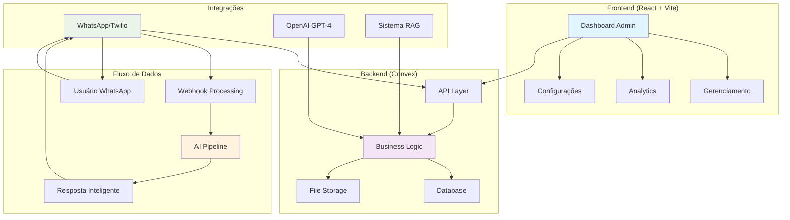

# 📚 WhatsApp AI Assistant - Documentação Completa

Bem-vindo à documentação completa do **WhatsApp AI Assistant**! Este sistema oferece um assistente de IA integrado ao WhatsApp com fluxo de entrevista estruturado, sistema RAG (Retrieval-Augmented Generation) e painel administrativo completo.

---

## 🚀 Início Rápido

### Para Usuários
- **[Guia Rápido](./guia-rapido.md)** - Como começar a usar o sistema em 5 minutos
- **[README Principal](./README.md)** - Visão geral completa do projeto

### Para Administradores
- **[Painel Administrativo](./admin-dashboard.md)** - Guia completo do dashboard
- **[Gerenciamento de Usuários](./admin-dashboard.md#-gerenciamento-de-participantes)** - Como gerenciar participantes

### Para Desenvolvedores
- **[Guia de Desenvolvimento](./desenvolvimento.md)** - Setup e padrões de código
- **[Deploy e Produção](./deployment.md)** - Como fazer deploy em produção

---

## 📖 Documentação por Categoria

### 🏗️ **Arquitetura e Sistema**

| Documento | Descrição | Público |
|-----------|-----------|---------|
| [README Principal](./README.md) | Visão geral, arquitetura e setup inicial | Todos |
| [Guia de Desenvolvimento](./desenvolvimento.md) | Padrões de código, setup dev, debugging | Desenvolvedores |
| [Deploy e Produção](./deployment.md) | CI/CD, configuração de produção, monitoramento | DevOps/Admins |

### 🤖 **Inteligência Artificial**

| Documento | Descrição | Público |
|-----------|-----------|---------|
| [Sistema RAG](./sistema-rag.md) | Como funciona o sistema de busca e IA | Técnico |
| [Fluxo de Entrevista](./fluxo-entrevista.md) | 8 estágios da entrevista estruturada | Admins/Usuários |

### 💬 **Integração WhatsApp**

| Documento | Descrição | Público |
|-----------|-----------|---------|
| [Integração WhatsApp](./integracao-whatsapp.md) | Twilio, webhooks, processamento de mensagens | Técnico |

### 🎛️ **Administração**

| Documento | Descrição | Público |
|-----------|-----------|---------|
| [Painel Administrativo](./admin-dashboard.md) | Dashboard, participantes, conversas, conhecimento | Administradores |
| [Guia Rápido](./guia-rapido.md) | Primeiros passos e tarefas comuns | Novos usuários |

### 🔧 **Referência Técnica**

| Documento | Descrição | Público |
|-----------|-----------|---------|
| [API Reference](./api-reference.md) | Endpoints, queries, mutations | Desenvolvedores |
| [Troubleshooting](./troubleshooting.md) | Problemas comuns e soluções | Todos |

---

## 🎯 Fluxos de Uso Comum

### 👤 **Novo Administrador**
1. [Guia Rápido](./guia-rapido.md) - Setup inicial
2. [Painel Administrativo](./admin-dashboard.md) - Conhecer o dashboard
3. [Sistema RAG](./sistema-rag.md) - Configurar base de conhecimento

### 👨‍💻 **Novo Desenvolvedor**
1. [README Principal](./README.md) - Entender o projeto
2. [Guia de Desenvolvimento](./desenvolvimento.md) - Setup do ambiente
3. [API Reference](./api-reference.md) - Conhecer as APIs

### 🚀 **Deploy em Produção**
1. [Guia de Desenvolvimento](./desenvolvimento.md) - Preparar ambiente
2. [Deploy e Produção](./deployment.md) - Processo completo
3. [Troubleshooting](./troubleshooting.md) - Resolver problemas

### 🔍 **Entender o Sistema**
1. [README Principal](./README.md) - Visão geral
2. [Fluxo de Entrevista](./fluxo-entrevista.md) - Como funciona a IA
3. [Sistema RAG](./sistema-rag.md) - Busca inteligente

---

## 🏛️ Arquitetura do Sistema

---

## 🔄 Fluxo de Entrevista (8 Estágios)

| Estágio | Objetivo | Duração Média | Documentação |
|---------|----------|---------------|--------------|
| **1. Boas-vindas** | Apresentação e contexto | 2-3 min | [Detalhes](./fluxo-entrevista.md#estágio-1-boas-vindas) |
| **2. Dados Pessoais** | Coleta de informações básicas | 3-5 min | [Detalhes](./fluxo-entrevista.md#estágio-2-dados-pessoais) |
| **3. Experiência Profissional** | Histórico de trabalho | 5-8 min | [Detalhes](./fluxo-entrevista.md#estágio-3-experiência-profissional) |
| **4. Competências Técnicas** | Habilidades específicas | 4-6 min | [Detalhes](./fluxo-entrevista.md#estágio-4-competências-técnicas) |
| **5. Expectativas** | Salário e benefícios | 3-4 min | [Detalhes](./fluxo-entrevista.md#estágio-5-expectativas) |
| **6. Disponibilidade** | Horários e localização | 2-3 min | [Detalhes](./fluxo-entrevista.md#estágio-6-disponibilidade) |
| **7. Perguntas Específicas** | Questões do recrutador | 5-10 min | [Detalhes](./fluxo-entrevista.md#estágio-7-perguntas-específicas) |
| **8. Finalização** | Próximos passos | 2-3 min | [Detalhes](./fluxo-entrevista.md#estágio-8-finalização) |

---

## 🛠️ Stack Tecnológico

### **Frontend**
- **React 18** - Interface de usuário
- **TypeScript** - Tipagem estática
- **Vite** - Build tool e dev server
- **Tailwind CSS** - Estilização
- **Radix UI** - Componentes acessíveis
- **React Router** - Roteamento

### **Backend**
- **Convex** - Backend-as-a-Service
- **Node.js** - Runtime JavaScript
- **TypeScript** - Tipagem no backend

### **Integrações**
- **Twilio** - WhatsApp Business API
- **OpenAI GPT-4** - Inteligência artificial
- **GitHub OAuth** - Autenticação

### **Infraestrutura**
- **Vercel/Netlify** - Deploy do frontend
- **Convex Cloud** - Hospedagem do backend
- **GitHub Actions** - CI/CD

---

## 📊 Métricas e KPIs

### **Métricas de Uso**
- Participantes ativos por dia/semana/mês
- Taxa de conclusão de entrevistas
- Tempo médio por estágio
- Satisfação dos usuários

### **Métricas Técnicas**
- Tempo de resposta da IA
- Taxa de erro de webhooks
- Uptime do sistema
- Performance das queries

### **Métricas de Negócio**
- Conversões por canal
- Qualidade dos leads
- ROI do sistema
- Eficiência do recrutamento

---

## 🔐 Segurança e Privacidade

### **LGPD Compliance**
- ✅ Consentimento explícito
- ✅ Direito ao esquecimento
- ✅ Portabilidade de dados
- ✅ Minimização de dados
- ✅ Criptografia em trânsito e repouso

### **Segurança Técnica**
- 🔒 Autenticação OAuth
- 🔒 Validação de webhooks
- 🔒 Rate limiting
- 🔒 Sanitização de dados
- 🔒 Headers de segurança

---

## 🆘 Suporte e Ajuda

### **Problemas Comuns**
- [Troubleshooting Geral](./troubleshooting.md)
- [Problemas de WhatsApp](./troubleshooting.md#-problemas-do-whatsapp)
- [Problemas de IA](./troubleshooting.md#-problemas-da-ia)
- [Problemas de Performance](./troubleshooting.md#-problemas-de-performance)

### **Contato**
- 📧 **Email**: suporte@empresa.com
- 💬 **Slack**: #whatsapp-ai-support
- 📱 **WhatsApp**: +55 11 99999-9999
- 🐛 **Issues**: [GitHub Issues](https://github.com/empresa/whatsapp-ai/issues)

### **Recursos Adicionais**
- 📖 [Convex Documentation](https://docs.convex.dev)
- 📖 [Twilio WhatsApp API](https://www.twilio.com/docs/whatsapp)
- 📖 [OpenAI API](https://platform.openai.com/docs)
- 📖 [React Documentation](https://react.dev)

---

## 🗺️ Roadmap

### **Versão Atual (v1.0)**
- ✅ Sistema de entrevista completo
- ✅ Painel administrativo
- ✅ Sistema RAG
- ✅ Integração WhatsApp

### **Próximas Versões**

#### **v1.1 - Melhorias de UX**
- [ ] Interface mobile otimizada
- [ ] Notificações push
- [ ] Temas personalizáveis
- [ ] Atalhos de teclado

#### **v1.2 - Analytics Avançado**
- [ ] Dashboards personalizáveis
- [ ] Relatórios automatizados
- [ ] Exportação de dados
- [ ] Integração com BI tools

#### **v1.3 - Integrações**
- [ ] Slack integration
- [ ] Teams integration
- [ ] CRM integration
- [ ] API pública

#### **v2.0 - Multi-tenant**
- [ ] Suporte a múltiplas empresas
- [ ] Billing automático
- [ ] White-label
- [ ] Marketplace de templates

---

## 📝 Contribuindo

### **Como Contribuir**
1. Fork o repositório
2. Crie uma branch para sua feature
3. Siga os [padrões de código](./desenvolvimento.md#padrões-de-código)
4. Escreva testes
5. Atualize a documentação
6. Abra um Pull Request

### **Tipos de Contribuição**
- 🐛 **Bug fixes**
- ✨ **Novas features**
- 📚 **Documentação**
- 🎨 **Melhorias de UI/UX**
- ⚡ **Performance**
- 🔒 **Segurança**

---

**📅 Última atualização**: Dezembro 2024  
**📋 Status do projeto**: 81% completo (8/12 fases)  
**🚀 Próxima milestone**: Fase 9 - Otimizações e Melhorias