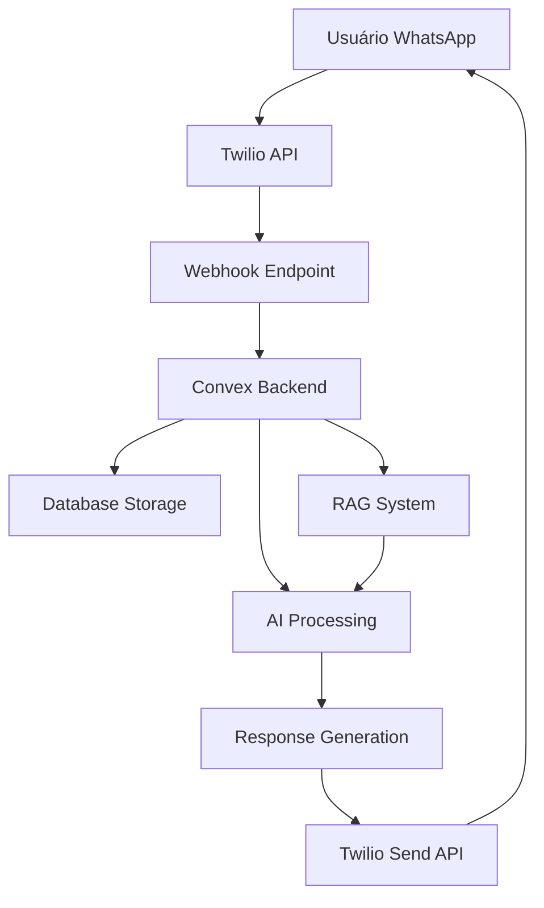

# 📱 Integração WhatsApp

## Visão Geral

O sistema utiliza **Twilio** para integração com WhatsApp, permitindo que usuários interajam com o bot através de mensagens. A integração é bidirecional: recebe mensagens dos usuários e envia respostas automatizadas.

**Fluxo**: WhatsApp → Twilio → Webhook → Convex → IA → Resposta → Twilio → WhatsApp

---

## 🏗️ Arquitetura da Integração

### Componentes Principais



### Stack Tecnológico
- **WhatsApp Business API**: Via Twilio
- **Webhook Processing**: Convex HTTP endpoints
- **Message Storage**: Convex database
- **AI Integration**: OpenAI GPT-4
- **Status Tracking**: Delivery receipts e read receipts

---

## 🔧 Configuração Inicial

### Credenciais Twilio
```typescript
// .env.local
interface TwilioConfig {
  TWILIO_ACCOUNT_SID: string,     // Account identifier
  TWILIO_AUTH_TOKEN: string,      // Authentication token
  TWILIO_PHONE_NUMBER: string,    // WhatsApp Business number
  TWILIO_WEBHOOK_URL: string      // Public webhook URL
}
```

### Configuração do Webhook
```typescript
// convex/http.ts
import { httpRouter } from "convex/server";
import { whatsappWebhook, whatsappStatus } from "./whatsapp";

const http = httpRouter();

// Receber mensagens
http.route({
  path: "/whatsapp/webhook",
  method: "POST",
  handler: whatsappWebhook,
});

// Status de entrega
http.route({
  path: "/whatsapp/status",
  method: "POST", 
  handler: whatsappStatus,
});

export default http;
```

### Configuração no Twilio Console
1. **Sandbox Setup** (desenvolvimento):
   ```
   Webhook URL: https://your-convex-site.convex.cloud/whatsapp/webhook
   Status Callback: https://your-convex-site.convex.cloud/whatsapp/status
   ```

2. **Production Setup**:
   - WhatsApp Business Account aprovado
   - Número dedicado configurado
   - Webhooks apontando para produção

---

## 📨 Processamento de Mensagens

### Recebimento de Mensagens

#### Estrutura do Webhook
```typescript
interface TwilioWebhookPayload {
  MessageSid: string,           // ID único da mensagem
  From: string,                 // whatsapp:+5511999999999
  To: string,                   // Número do bot
  Body: string,                 // Conteúdo da mensagem
  NumMedia?: string,            // Número de anexos
  MediaUrl0?: string,           // URL do primeiro anexo
  MediaContentType0?: string,   // Tipo do anexo
  Timestamp: string,            // Timestamp da mensagem
  ProfileName?: string          // Nome do perfil do usuário
}
```

#### Processamento do Webhook
```typescript
// convex/whatsapp.ts
export const whatsappWebhook = httpAction(async (ctx, request) => {
  const formData = await request.formData();
  const payload = Object.fromEntries(formData.entries());
  
  // Validar assinatura Twilio (produção)
  if (process.env.NODE_ENV === 'production') {
    const isValid = validateTwilioSignature(request, payload);
    if (!isValid) {
      return new Response('Unauthorized', { status: 401 });
    }
  }
  
  // Extrair dados da mensagem
  const message = {
    sid: payload.MessageSid as string,
    from: payload.From as string,
    to: payload.To as string,
    body: payload.Body as string,
    timestamp: new Date(payload.Timestamp as string),
    profileName: payload.ProfileName as string,
    mediaUrl: payload.MediaUrl0 as string,
    mediaType: payload.MediaContentType0 as string
  };
  
  // Processar mensagem
  await ctx.runMutation(internal.whatsapp.processInboundMessage, { message });
  
  return new Response('OK', { status: 200 });
});
```

### Armazenamento de Mensagens

#### Schema do Banco
```typescript
// convex/schema.ts
export default defineSchema({
  messages: defineTable({
    sid: v.string(),                    // Twilio Message SID
    conversationId: v.id("conversations"),
    direction: v.union(v.literal("inbound"), v.literal("outbound")),
    from: v.string(),                   // Número de origem
    to: v.string(),                     // Número de destino
    content: v.string(),                // Conteúdo da mensagem
    mediaUrl: v.optional(v.string()),   // URL de mídia
    mediaType: v.optional(v.string()),  // Tipo de mídia
    status: v.union(
      v.literal("received"),
      v.literal("sent"),
      v.literal("delivered"),
      v.literal("read"),
      v.literal("failed")
    ),
    timestamp: v.number(),              // Unix timestamp
    metadata: v.optional(v.object({
      profileName: v.optional(v.string()),
      errorCode: v.optional(v.string()),
      errorMessage: v.optional(v.string())
    }))
  })
  .index("by_conversation", ["conversationId", "timestamp"])
  .index("by_sid", ["sid"])
  .index("by_status", ["status"])
});
```

---

## 🤖 Processamento de IA

### Pipeline de Resposta

#### 1. Identificação do Usuário
```typescript
async function identifyUser(phoneNumber: string) {
  // Buscar participante existente
  let participant = await ctx.db.query("participants")
    .withIndex("by_phone", (q) => q.eq("phoneNumber", phoneNumber))
    .first();
    
  // Criar novo se não existir
  if (!participant) {
    participant = await ctx.db.insert("participants", {
      phoneNumber,
      currentStage: "intro",
      createdAt: Date.now(),
      isActive: true
    });
  }
  
  return participant;
}
```

#### 2. Contexto da Conversa
```typescript
async function buildConversationContext(participantId: Id<"participants">) {
  // Buscar mensagens recentes
  const recentMessages = await ctx.db.query("messages")
    .withIndex("by_conversation", (q) => 
      q.eq("conversationId", participantId)
    )
    .order("desc")
    .take(10);
    
  // Buscar estado da entrevista
  const interviewState = await ctx.db.query("interviewStates")
    .withIndex("by_participant", (q) => q.eq("participantId", participantId))
    .first();
    
  return {
    messages: recentMessages.reverse(),
    currentStage: interviewState?.currentStage || "intro",
    stageData: interviewState?.stageData || {}
  };
}
```

#### 3. Geração de Resposta
```typescript
async function generateAIResponse(
  userMessage: string,
  context: ConversationContext
) {
  // Buscar conhecimento relevante (RAG)
  const relevantKnowledge = await semanticSearch(userMessage, 3);
  
  // Construir prompt
  const prompt = buildStagePrompt(
    context.currentStage,
    userMessage,
    context.messages,
    relevantKnowledge
  );
  
  // Chamar OpenAI
  const response = await openai.chat.completions.create({
    model: "gpt-4",
    messages: [
      { role: "system", content: prompt.system },
      ...context.messages.map(msg => ({
        role: msg.direction === "inbound" ? "user" : "assistant",
        content: msg.content
      })),
      { role: "user", content: userMessage }
    ],
    temperature: 0.7,
    max_tokens: 500
  });
  
  return response.choices[0].message.content;
}
```

---

## 📤 Envio de Mensagens

### API de Envio

#### Função de Envio
```typescript
// convex/whatsapp.ts
export const sendMessage = internalAction(async (ctx, args: {
  to: string,
  content: string,
  mediaUrl?: string
}) => {
  const client = twilio(
    process.env.TWILIO_ACCOUNT_SID,
    process.env.TWILIO_AUTH_TOKEN
  );
  
  try {
    const message = await client.messages.create({
      from: `whatsapp:${process.env.TWILIO_PHONE_NUMBER}`,
      to: `whatsapp:${args.to}`,
      body: args.content,
      ...(args.mediaUrl && { mediaUrl: [args.mediaUrl] })
    });
    
    // Salvar mensagem enviada
    await ctx.runMutation(internal.whatsapp.saveOutboundMessage, {
      sid: message.sid,
      to: args.to,
      content: args.content,
      mediaUrl: args.mediaUrl,
      status: "sent"
    });
    
    return message.sid;
  } catch (error) {
    console.error('Erro ao enviar mensagem:', error);
    throw error;
  }
});
```

#### Rate Limiting
```typescript
interface RateLimitConfig {
  messagesPerSecond: 1,        // Limite global
  messagesPerMinute: 60,       // Por usuário
  messagesPerHour: 1000,       // Por usuário
  burstLimit: 5                // Rajada permitida
}

async function checkRateLimit(phoneNumber: string): Promise<boolean> {
  const now = Date.now();
  const oneMinute = 60 * 1000;
  const oneHour = 60 * 60 * 1000;
  
  // Contar mensagens recentes
  const recentMessages = await ctx.db.query("messages")
    .withIndex("by_phone_timestamp", (q) => 
      q.eq("to", phoneNumber).gte("timestamp", now - oneHour)
    )
    .collect();
    
  const lastMinute = recentMessages.filter(m => 
    m.timestamp > now - oneMinute
  ).length;
  
  const lastHour = recentMessages.length;
  
  return lastMinute < 60 && lastHour < 1000;
}
```

---

## 📊 Status e Delivery

### Tracking de Status

#### Webhook de Status
```typescript
export const whatsappStatus = httpAction(async (ctx, request) => {
  const formData = await request.formData();
  const payload = Object.fromEntries(formData.entries());
  
  const statusUpdate = {
    messageSid: payload.MessageSid as string,
    status: payload.MessageStatus as MessageStatus,
    timestamp: new Date(),
    errorCode: payload.ErrorCode as string,
    errorMessage: payload.ErrorMessage as string
  };
  
  await ctx.runMutation(internal.whatsapp.updateMessageStatus, statusUpdate);
  
  return new Response('OK', { status: 200 });
});
```

#### Estados de Mensagem
```typescript
type MessageStatus = 
  | 'queued'      // Na fila do Twilio
  | 'sent'        // Enviada para WhatsApp
  | 'delivered'   // Entregue ao dispositivo
  | 'read'        // Lida pelo usuário
  | 'failed'      // Falha na entrega
  | 'undelivered' // Não entregue
```

### Métricas de Entrega
```typescript
interface DeliveryMetrics {
  totalSent: number,
  deliveryRate: number,        // % entregues
  readRate: number,           // % lidas
  failureRate: number,        // % falharam
  averageDeliveryTime: number, // ms
  averageReadTime: number     // ms
}
```

---

## 🔒 Segurança

### Validação de Webhook

#### Assinatura Twilio
```typescript
import { validateRequest } from 'twilio';

function validateTwilioSignature(
  request: Request,
  payload: Record<string, string>
): boolean {
  const signature = request.headers.get('X-Twilio-Signature');
  const url = request.url;
  const authToken = process.env.TWILIO_AUTH_TOKEN;
  
  return validateRequest(authToken, signature, url, payload);
}
```

#### Rate Limiting por IP
```typescript
interface IPRateLimit {
  [ip: string]: {
    requests: number,
    windowStart: number,
    blocked: boolean
  }
}

const ipLimits: IPRateLimit = {};

function checkIPRateLimit(ip: string): boolean {
  const now = Date.now();
  const windowSize = 60 * 1000; // 1 minuto
  const maxRequests = 100;
  
  if (!ipLimits[ip]) {
    ipLimits[ip] = { requests: 1, windowStart: now, blocked: false };
    return true;
  }
  
  const limit = ipLimits[ip];
  
  // Reset window se necessário
  if (now - limit.windowStart > windowSize) {
    limit.requests = 1;
    limit.windowStart = now;
    limit.blocked = false;
    return true;
  }
  
  limit.requests++;
  
  if (limit.requests > maxRequests) {
    limit.blocked = true;
    return false;
  }
  
  return true;
}
```

### Sanitização de Dados
```typescript
function sanitizeMessage(content: string): string {
  // Remover caracteres perigosos
  return content
    .replace(/<script\b[^<]*(?:(?!<\/script>)<[^<]*)*<\/script>/gi, '')
    .replace(/javascript:/gi, '')
    .replace(/on\w+\s*=/gi, '')
    .trim()
    .substring(0, 1600); // Limite do WhatsApp
}
```

---

## 🚨 Tratamento de Erros

### Tipos de Erro

#### Erros de Twilio
```typescript
interface TwilioError {
  code: number,
  message: string,
  moreInfo: string,
  status: number
}

const TWILIO_ERROR_CODES = {
  21211: 'Invalid phone number',
  21614: 'Message body is required',
  21617: 'Message body too long',
  63007: 'Message delivery failed',
  63016: 'Message rate exceeded'
};
```

#### Retry Logic
```typescript
async function sendMessageWithRetry(
  to: string,
  content: string,
  maxRetries: number = 3
): Promise<string> {
  let lastError: Error;
  
  for (let attempt = 1; attempt <= maxRetries; attempt++) {
    try {
      return await sendMessage(to, content);
    } catch (error) {
      lastError = error as Error;
      
      // Não retry para erros permanentes
      if (isPermanentError(error)) {
        throw error;
      }
      
      // Backoff exponencial
      const delay = Math.pow(2, attempt) * 1000;
      await new Promise(resolve => setTimeout(resolve, delay));
    }
  }
  
  throw lastError;
}

function isPermanentError(error: any): boolean {
  const permanentCodes = [21211, 21614, 21617]; // Invalid number, etc
  return permanentCodes.includes(error.code);
}
```

---

## 📈 Monitoramento

### Métricas Importantes

#### Volume de Mensagens
```typescript
interface MessageVolume {
  totalInbound: number,
  totalOutbound: number,
  messagesPerHour: number,
  peakHour: string,
  averageResponseTime: number
}
```

#### Qualidade do Serviço
```typescript
interface ServiceQuality {
  uptime: number,              // %
  errorRate: number,           // %
  averageLatency: number,      // ms
  webhookReliability: number   // %
}
```

### Alertas Automáticos
```typescript
interface AlertConfig {
  highErrorRate: {
    threshold: 5,              // % de erro
    window: 300,              // 5 minutos
    action: 'email_admin'
  },
  highLatency: {
    threshold: 5000,          // 5 segundos
    window: 600,              // 10 minutos
    action: 'slack_notification'
  },
  webhookDown: {
    threshold: 3,             // Falhas consecutivas
    action: 'emergency_alert'
  }
}
```

---

## 🔧 Configuração de Desenvolvimento

### Ngrok para Testes Locais
```bash
# Instalar ngrok
npm install -g ngrok

# Expor porta local
ngrok http 3000

# Configurar webhook no Twilio
# URL: https://abc123.ngrok.io/whatsapp/webhook
```

### Simulação de Mensagens
```typescript
// Função para testar localmente
export const simulateMessage = internalAction(async (ctx, args: {
  from: string,
  body: string
}) => {
  const mockPayload = {
    MessageSid: `SM${Date.now()}`,
    From: `whatsapp:${args.from}`,
    To: `whatsapp:${process.env.TWILIO_PHONE_NUMBER}`,
    Body: args.body,
    Timestamp: new Date().toISOString()
  };
  
  return await processInboundMessage(ctx, { message: mockPayload });
});
```

### Logs de Debug
```typescript
// Logging estruturado
function logMessage(direction: 'inbound' | 'outbound', data: any) {
  console.log(JSON.stringify({
    timestamp: new Date().toISOString(),
    direction,
    from: data.from,
    to: data.to,
    contentLength: data.content?.length || 0,
    hasMedia: !!data.mediaUrl,
    stage: data.stage
  }));
}
```

---

## 🎯 Melhores Práticas

### Performance
1. **Cache responses** para perguntas frequentes
2. **Batch processing** para múltiplas mensagens
3. **Async processing** para operações pesadas
4. **Connection pooling** para APIs externas

### Confiabilidade
1. **Idempotência** em todas as operações
2. **Retry logic** com backoff exponencial
3. **Circuit breaker** para APIs externas
4. **Health checks** regulares

### Experiência do Usuário
1. **Typing indicators** para operações longas
2. **Message chunking** para respostas longas
3. **Rich media** quando apropriado
4. **Quick replies** para opções comuns

### Compliance
1. **Opt-out handling** obrigatório
2. **Data retention** conforme LGPD
3. **Audit logs** para todas as interações
4. **Rate limiting** para prevenir spam

---

**💡 Dica**: Sempre teste a integração no Twilio Sandbox antes de ir para produção, e mantenha logs detalhados para facilitar o debugging!