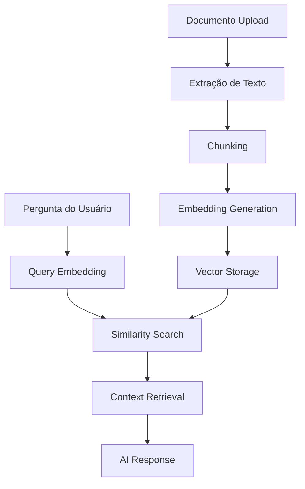

# 🧠 Sistema RAG (Retrieval-Augmented Generation)

## Visão Geral

O sistema RAG permite que o bot WhatsApp acesse e utilize conhecimento específico da organização para fornecer respostas mais precisas e contextualizadas durante as entrevistas.

**Fluxo**: Pergunta → Busca Semântica → Contexto Relevante → Resposta com IA

---

## 🏗️ Arquitetura do Sistema

### Componentes Principais



### Stack Tecnológico
- **Embeddings**: OpenAI `text-embedding-ada-002`
- **Vector Storage**: Convex com índices otimizados
- **Text Processing**: Chunking inteligente por contexto
- **Search**: Busca por similaridade de cosseno
- **AI Integration**: GPT-4 com contexto enriquecido

---

## 📄 Processamento de Documentos

### Formatos Suportados

```typescript
interface SupportedFormats {
  'application/pdf': {
    maxSize: '10MB',
    processor: 'pdf-parse',
    features: ['text', 'metadata']
  },
  'text/plain': {
    maxSize: '5MB',
    processor: 'direct',
    features: ['text']
  },
  'text/markdown': {
    maxSize: '5MB',
    processor: 'markdown-parser',
    features: ['text', 'structure']
  },
  'application/msword': {
    maxSize: '10MB',
    processor: 'mammoth',
    features: ['text', 'formatting']
  }
}
```

### Pipeline de Processamento

#### 1. Upload e Validação
```typescript
// Validação de arquivo
interface DocumentValidation {
  format: boolean,        // Formato suportado?
  size: boolean,         // Tamanho dentro do limite?
  content: boolean,      // Conteúdo legível?
  encoding: boolean      // Encoding válido?
}
```

#### 2. Extração de Texto
```typescript
// Resultado da extração
interface ExtractedContent {
  text: string,           // Texto limpo
  metadata: {
    title?: string,       // Título do documento
    author?: string,      // Autor
    pages?: number,       // Número de páginas
    wordCount: number,    // Contagem de palavras
    language?: string     // Idioma detectado
  },
  structure?: {
    headings: string[],   // Cabeçalhos encontrados
    sections: Section[]   // Seções estruturadas
  }
}
```

#### 3. Chunking Inteligente
```typescript
interface ChunkingStrategy {
  maxChunkSize: 1000,           // Tokens por chunk
  overlapSize: 200,             // Sobreposição entre chunks
  splitBy: 'sentence' | 'paragraph' | 'section',
  preserveContext: boolean,     // Manter contexto entre chunks
  metadata: {
    source: string,             // Documento origem
    chunkIndex: number,         // Posição no documento
    section?: string,           // Seção do documento
    pageNumber?: number         // Página (se aplicável)
  }
}
```

#### 4. Geração de Embeddings
```typescript
// Configuração de embeddings
interface EmbeddingConfig {
  model: 'text-embedding-ada-002',
  dimensions: 1536,
  batchSize: 100,              // Chunks por batch
  retryPolicy: {
    maxRetries: 3,
    backoffMs: 1000
  }
}

// Resultado
interface DocumentEmbedding {
  chunkId: string,
  embedding: number[],         // Vetor 1536D
  text: string,               // Texto original
  metadata: ChunkMetadata
}
```

---

## 🔍 Sistema de Busca

### Busca Semântica

#### Processo de Query
```typescript
async function semanticSearch(query: string, limit: number = 5) {
  // 1. Gerar embedding da pergunta
  const queryEmbedding = await openai.embeddings.create({
    model: "text-embedding-ada-002",
    input: query
  });

  // 2. Buscar chunks similares
  const results = await ctx.db.query("documentEmbeddings")
    .withSearchIndex("by_embedding", (q) => 
      q.similar("embedding", queryEmbedding.data[0].embedding, limit)
    )
    .collect();

  // 3. Calcular scores de relevância
  return results.map(chunk => ({
    ...chunk,
    relevanceScore: cosineSimilarity(queryEmbedding, chunk.embedding)
  }));
}
```

#### Filtros Avançados
```typescript
interface SearchFilters {
  documentTypes?: string[],    // Filtrar por tipo de documento
  dateRange?: {               // Filtrar por data
    from: Date,
    to: Date
  },
  minRelevance?: number,      // Score mínimo de relevância
  sections?: string[],        // Seções específicas
  authors?: string[]          // Autores específicos
}
```

### Ranking e Relevância

#### Algoritmo de Score
```typescript
function calculateRelevanceScore(
  semanticScore: number,      // Similaridade de cosseno
  metadata: ChunkMetadata
): number {
  let score = semanticScore;
  
  // Boost para documentos recentes
  const daysSinceUpload = daysBetween(metadata.uploadDate, new Date());
  if (daysSinceUpload < 30) {
    score *= 1.1;
  }
  
  // Boost para seções importantes
  if (metadata.section?.includes('introdução') || 
      metadata.section?.includes('resumo')) {
    score *= 1.2;
  }
  
  // Penalidade para chunks muito pequenos
  if (metadata.wordCount < 50) {
    score *= 0.8;
  }
  
  return score;
}
```

---

## 🤖 Integração com IA

### Context Assembly

#### Preparação do Contexto
```typescript
interface RAGContext {
  query: string,              // Pergunta original
  relevantChunks: Chunk[],    // Chunks mais relevantes
  conversationHistory: Message[], // Histórico da conversa
  userProfile: {              // Perfil do usuário
    currentStage: string,
    preferences?: string[],
    previousTopics: string[]
  }
}
```

#### Template de Prompt
```typescript
const RAG_PROMPT_TEMPLATE = `
Você é um assistente especializado em entrevistas de jornada pessoal.

CONTEXTO RELEVANTE:
${relevantChunks.map(chunk => `
- Fonte: ${chunk.metadata.source}
- Conteúdo: ${chunk.text}
- Relevância: ${chunk.relevanceScore.toFixed(2)}
`).join('\n')}

HISTÓRICO DA CONVERSA:
${conversationHistory.slice(-5).map(msg => 
  `${msg.direction}: ${msg.content}`
).join('\n')}

ETAPA ATUAL: ${userProfile.currentStage}

PERGUNTA DO USUÁRIO: ${query}

INSTRUÇÕES:
1. Use o contexto relevante para enriquecer sua resposta
2. Mantenha o foco na etapa atual da entrevista
3. Seja empático e acolhedor
4. Se o contexto não for suficiente, seja honesto sobre limitações
5. Sempre cite as fontes quando usar informações específicas

RESPOSTA:
`;
```

### Response Enhancement

#### Citação de Fontes
```typescript
interface EnhancedResponse {
  content: string,            // Resposta principal
  sources: {                  // Fontes utilizadas
    documentName: string,
    section?: string,
    relevanceScore: number,
    snippet: string           // Trecho relevante
  }[],
  confidence: number,         // Confiança na resposta (0-1)
  suggestedFollowUp?: string  // Pergunta de acompanhamento
}
```

---

## 📊 Monitoramento e Analytics

### Métricas de Performance

#### Qualidade da Busca
```typescript
interface SearchMetrics {
  averageRelevanceScore: number,    // Score médio dos resultados
  queryResponseTime: number,        // Tempo de resposta (ms)
  hitRate: number,                 // % de queries com resultados relevantes
  userSatisfaction: number,        // Feedback dos usuários
  topQueries: {                    // Queries mais frequentes
    query: string,
    count: number,
    avgRelevance: number
  }[]
}
```

#### Uso de Documentos
```typescript
interface DocumentUsage {
  documentId: string,
  name: string,
  totalQueries: number,           // Vezes que foi consultado
  avgRelevanceScore: number,      // Relevância média
  lastUsed: Date,                // Última consulta
  topSections: {                 // Seções mais utilizadas
    section: string,
    usage: number
  }[]
}
```

### Dashboard de RAG

#### Métricas em Tempo Real
- **Queries/min**: Volume de consultas
- **Latência p95**: Tempo de resposta
- **Cache Hit Rate**: Eficiência do cache
- **Embedding Usage**: Tokens consumidos

#### Análise de Conteúdo
- **Documentos Mais Úteis**: Por score de relevância
- **Gaps de Conhecimento**: Queries sem bons resultados
- **Tópicos Populares**: Assuntos mais consultados
- **Qualidade por Fonte**: Performance por documento

---

## 🔧 Configuração e Otimização

### Parâmetros de Busca

```typescript
interface RAGConfig {
  search: {
    maxResults: 5,              // Máximo de chunks por query
    minRelevanceScore: 0.7,     // Score mínimo para incluir
    diversityThreshold: 0.8,    // Evitar chunks muito similares
    contextWindow: 4000         // Tokens máximos de contexto
  },
  chunking: {
    maxChunkSize: 1000,         // Tokens por chunk
    overlapSize: 200,           // Sobreposição
    splitStrategy: 'semantic'   // Como dividir o texto
  },
  caching: {
    queryTTL: 3600,            // Cache de queries (segundos)
    embeddingTTL: 86400,       // Cache de embeddings
    maxCacheSize: 1000         // Máximo de queries em cache
  }
}
```

### Otimizações de Performance

#### Cache Inteligente
```typescript
// Cache de queries frequentes
interface QueryCache {
  query: string,
  queryHash: string,          // Hash da query
  results: SearchResult[],
  timestamp: Date,
  hitCount: number           // Quantas vezes foi usado
}

// Cache de embeddings
interface EmbeddingCache {
  text: string,
  textHash: string,
  embedding: number[],
  model: string,
  timestamp: Date
}
```

#### Índices Otimizados
```typescript
// Convex schema para busca eficiente
export default defineSchema({
  documentEmbeddings: defineTable({
    documentId: v.id("documents"),
    chunkIndex: v.number(),
    text: v.string(),
    embedding: v.array(v.number()),
    metadata: v.object({
      source: v.string(),
      section: v.optional(v.string()),
      wordCount: v.number(),
      uploadDate: v.number()
    })
  })
  .searchIndex("by_embedding", {
    searchField: "embedding",
    filterFields: ["documentId", "metadata.source"]
  })
  .index("by_document", ["documentId", "chunkIndex"])
  .index("by_source", ["metadata.source"])
});
```

---

## 🚨 Troubleshooting

### Problemas Comuns

#### Baixa Qualidade de Resultados
**Sintomas**: Respostas irrelevantes, score baixo
**Soluções**:
```typescript
// 1. Ajustar threshold de relevância
const config = {
  minRelevanceScore: 0.6  // Reduzir se muito restritivo
};

// 2. Melhorar chunking
const chunkingConfig = {
  strategy: 'semantic',    // Usar divisão semântica
  preserveContext: true   // Manter contexto
};

// 3. Reprocessar documentos
await reindexDocument(documentId);
```

#### Lentidão na Busca
**Sintomas**: Tempo de resposta > 2s
**Soluções**:
```typescript
// 1. Otimizar índices
await ctx.db.query("documentEmbeddings")
  .withSearchIndex("by_embedding_optimized")  // Usar índice otimizado
  .collect();

// 2. Implementar cache
const cachedResult = await getFromCache(queryHash);
if (cachedResult) return cachedResult;

// 3. Reduzir dimensionalidade (se necessário)
const embedding = await generateEmbedding(text, { dimensions: 768 });
```

#### Documentos Não Processam
**Sintomas**: Status "failed" ou "pending"
**Diagnóstico**:
```typescript
// Verificar logs de processamento
const failedDocs = await ctx.db.query("documents")
  .filter(q => q.eq(q.field("status"), "failed"))
  .collect();

// Verificar quota da OpenAI
const usage = await openai.usage.get();
console.log('Tokens restantes:', usage.remaining);
```

### Logs Importantes

#### Convex Functions
```typescript
// Em rag.ts
console.log('Processing document:', documentId);
console.log('Chunks generated:', chunks.length);
console.log('Embeddings created:', embeddings.length);
console.log('Average relevance:', avgScore);
```

#### Performance Monitoring
```typescript
// Métricas de busca
const searchStart = Date.now();
const results = await semanticSearch(query);
const searchTime = Date.now() - searchStart;

console.log(`Search completed in ${searchTime}ms`);
console.log(`Found ${results.length} relevant chunks`);
console.log(`Top score: ${results[0]?.relevanceScore}`);
```

---

## 🎯 Melhores Práticas

### Preparação de Documentos
1. **Estruture bem**: Use cabeçalhos e seções claras
2. **Seja específico**: Evite informações genéricas demais
3. **Atualize regularmente**: Mantenha conteúdo relevante
4. **Teste a qualidade**: Faça perguntas e veja os resultados

### Otimização de Queries
1. **Use linguagem natural**: O sistema funciona melhor com perguntas completas
2. **Seja específico**: Perguntas vagas geram resultados vagos
3. **Contextualize**: Mencione o contexto da pergunta
4. **Itere**: Refine baseado nos resultados

### Monitoramento Contínuo
1. **Acompanhe métricas**: Score de relevância, tempo de resposta
2. **Analise gaps**: Identifique tópicos sem boa cobertura
3. **Colete feedback**: Usuários indicam qualidade das respostas
4. **Otimize regularmente**: Ajuste parâmetros baseado no uso

---

**💡 Dica**: O sistema RAG funciona melhor com documentos bem estruturados e específicos do domínio. Invista tempo na curadoria do conteúdo para obter melhores resultados!